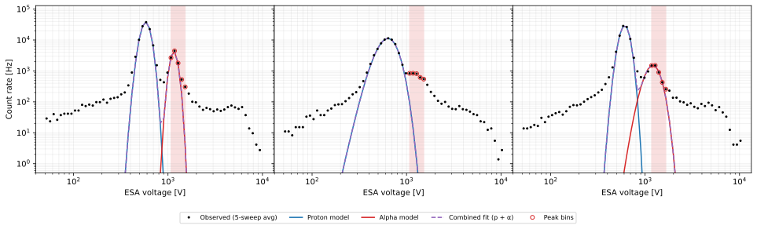

# SWAPI Alpha Solar Wind Data Product

After [fitting the solar wind proton parameters](./proton-sw.md) on a five-sweep chunk, the proton parameters are held fixed and three parameters of the solar wind alpha population are estimated: density $`n^{\alpha}`$, temperature $`T^{\alpha}`$, and a field-aligned drift speed $`\Delta v^{\alpha}`$.
The alpha bulk velocity is modeled as
```math
\mathbf{v}^{\alpha} = \mathbf{v}^{p} + \Delta v^{\alpha} \thinspace  \hat{\mathbf{B}},
```
where $`\mathbf{v}^{p}`$ is the proton bulk velocity and $`\hat{\mathbf{B}}`$ is the direction of the chunk-averaged magnetic field.
The solution vector used for optimization is
```math
\mathbf{x}^{\alpha} = (\log n^{\alpha},\thinspace  \log T^{\alpha},\thinspace  \Delta v^{\alpha}).
```

The inputs that are used for fitting protons are also used for fitting alphas except that only the core 62 ESA steps are used.

The solar wind alpha data product has an additional magnetic field dependency because the model constrains the alpha-proton drift to lie along $`\hat{\mathbf{B}}`$.
MAG L2 is preferred, but when it is not yet available, L1D is used and the `PRELIMINARY_MAG` flag is set.
For each five-sweep alpha chunk, the magnetic field in RTN components is averaged over the one-minute interval.
The mean vector is then normalized, providing $`\hat{\mathbf{B}}^{\text{RTN}}`$.
When the window has no non-fill values, it is skipped and fill values are reported.

For alphas, the coincidence rate is modeled as the sum of the proton and alpha contributions with deadtime correction applied after the summation:

```math
C(V) = \bigl[C^{p}(V) + C^{\alpha}(V;\thinspace  \mathbf{x}^{\alpha})\bigr]\cdot\mathcal{D}\bigl(C^{p}(V) + C^{\alpha}(V;\thinspace  \mathbf{x}^{\alpha})\bigr),
```

where $`C^p`$ ($`C^\alpha`$) is the coincidence rate contribution from protons (alphas) evaluated using the [solar wind forward model](./proton-sw.md#forward-model).

> 
>
> *Generated by `docs/swapi/figure_src/plot_alpha_peak_finding.py`.*


Before fitting the alpha distribution, the points to include in the fit must be identified.
First, the proton-subtracted residuals are calculated:
```math
R_i = C_i - 2C_i^p.
```
The alpha peak is identified as the maximum between the first increase in $R_i$ between $1.5\times$ and $4\times$ the energy per charge of the proton peak.
The factor of two in the residual is so that that errors in the proton model on the order of a few percent are not mistaken for the alpha peak.
Once the peak is identified, one point at lower energy and three points at higher energies—in addition to the peak itself, for a total of five points—are used for to fit the alpha parameters.
The fit fails if the selected five points do not fall within the $1.5\times$ to $4\times$ range.

After that, the alpha parameters are initialized with $`T^\alpha = T^p`$ and $`\Delta v^\alpha = 0`$ then optimized using `scipy.optimize.least_squares` with `method='lm'` to solve
```math
\hat{\mathbf{x}}^{\alpha} = \arg\min_{\mathbf{x}^{\alpha}} \sum_{s} \sum_{i} \left[\thinspace C_{i,s}^{\text{observed}}(\mathbf{x}^{\alpha}) - C_{i,s} \thinspace \right]^{2}, \qquad i \in \text{peak window},\quad s \in \{1, \ldots, 5\},
```
where $`C_{i,s}`$ is the measured coincidence rate for ESA step $`i`$ of sweep $`s`$ and $`C_{i,s}^{\text{observed}}(\mathbf{x}^{\alpha})`$ is the model coincidence rate.
The Jacobian is the same as for protons except for the differential flow:
```math
\frac{\partial C^{\alpha}}{\partial (\Delta v^{\alpha})} = \nabla_{\mathbf{v}^{\alpha}} C^{\alpha} \cdot \hat{\mathbf{B}} = \sum_{c \in \{R, T, N\}} \frac{\partial C^{\alpha}}{\partial v_{\alpha, c}}\thinspace \hat{B}_{c}.
```

With the deadtime correction included, the Jacobian is thus:
```math
J^{\alpha}
= \mathcal{D}^{2}(C^{p} + C^{\alpha})
\begin{bmatrix}
\dfrac{\partial C^{\alpha}}{\partial \log n^{\alpha}} &
\dfrac{\partial C^{\alpha}}{\partial \log T^{\alpha}} &
\nabla_{\mathbf{v}^{\alpha}} C^{\alpha} \cdot \hat{\mathbf{B}}
\end{bmatrix}.
```

The covariance matrix $`\Sigma_{\mathbf{x}^{\alpha}}`$ is estimated from the Jacobian and the residuals using the [HC3 method](./parameter-uncertainty.md).

Some notes on error handling:
- If the proton fit fails, fill values are reported and the proton quality flag is propagated.
- If the alpha fit fails at any point, fill values are reported and `FIT_ERROR` is set.
- If the fitted alpha bulk speed is less than 90% of the fitted proton bulk speed, fill values are reported and `BAD_FIT` is set. This is intended to avoid confusing the proton beam population for the alpha population.
- If the alpha fit converges but $`R^{2} < 0.9`$, fill values are reported and `BAD_FIT` is set.

`R^{2}`$ is computed using the sweep-averaged coincidence rate for the points used in the alpha fit.


Finally, the `alpha-sw` CDF variables are derived from the fitted parameter vector $`\mathbf{x}^{\alpha}`$ and its covariance $`\Sigma_{x^{\alpha}}`$ as follows:

| CDF variable                          | Symbol                                            | Definition                                                                                                                |
|---------------------------------------|---------------------------------------------------|---------------------------------------------------------------------------------------------------------------------------|
| `epoch`                               | $`t_{\text{center}}`$                                 | center time of the 5-sweep chunk                                                                                          |
| `epoch_delta`                         |                                                   | $`30\thinspace \text{s}`$ (half-width of the 5-sweep chunk)                                                                       |
| `alpha_sw_density`                    | $`n^{\alpha}`$                                        | $`\exp(x^{\alpha}_{0})`$                                                                                                      |
| `alpha_sw_density_uncert`             | $`\sigma_{n^{\alpha}}`$                               | $`n^{\alpha}\thinspace \sqrt{\Sigma_{x^{\alpha}}[0, 0]}`$                                                                               |
| `alpha_sw_temperature`                | $`T^{\alpha}`$                                        | $`\exp(x^{\alpha}_{1})`$                                                                                                      |
| `alpha_sw_temperature_uncert`         | $`\sigma_{T^{\alpha}}`$                               | $`T^{\alpha}\thinspace \sqrt{\Sigma_{x^{\alpha}}[1, 1]}`$                                                                               |
| `alpha_sw_velocity_rtn`               | $`\mathbf{v}^{\alpha,\text{SC}}`$                     | $`\mathbf{v}_{b}^{\text{SC}} + x^{\alpha}_{2}\thinspace \hat{\mathbf{B}}`$ <sup>[1](#fn-vp)</sup>                                            |
| `alpha_sw_velocity_rtn_covariance`    | $`\Sigma_{\mathbf{v}^{\alpha}}`$                      | $`\Sigma_{\mathbf{v}^{p}} + \Sigma_{x^{\alpha}}[2,2 ]\thinspace \hat{\mathbf{B}}\hat{\mathbf{B}}^{\top}`$ |
| `alpha_sw_velocity_rtn_uncert`        | $`\sigma_{\mathbf{v}^{\alpha}}`$                      | $`\sqrt{\operatorname{diag}(\Sigma_{\mathbf{v}^{\alpha}})}`$ (same for `alpha_sw_velocity_rtn_sun`)                       |
| `alpha_sw_speed`                      | $`\lvert\mathbf{v}^{\alpha,\text{SC}}\rvert`$         | $`\lvert\mathbf{v}^{\alpha,\text{SC}}\rvert`$                                                                                 |
| `alpha_sw_speed_uncert`               | $`\sigma_{\lvert\mathbf{v}^{\alpha,\text{SC}}\rvert}`$ | propagated through `uncertainties` from $`\mathbf{v}^{\alpha,\text{SC}}`$                                                     |
| `alpha_sw_velocity_rtn_sun`           | $`\mathbf{v}^{\alpha,\text{sun}}`$                    | $`\mathbf{v}^{\alpha,\text{SC}} + \mathbf{v}_{\text{sc}}^{\text{sun}}`$                                                                   |
| `alpha_sw_speed_sun`                  | $`\lvert\mathbf{v}^{\alpha,\text{sun}}\rvert`$        | $`\lvert\mathbf{v}^{\alpha,\text{sun}}\rvert`$                                                                                |
| `alpha_sw_speed_sun_uncert`           | $`\sigma_{\lvert\mathbf{v}^{\alpha,\text{sun}}\rvert}`$ | propagated through `uncertainties` from $`\mathbf{v}^{\alpha,\text{sun}}`$                                                    |
| `swp_flags`                           |                                                   | quality flag bitmask (see `SwapiL3Flags`)                                                                                 |


<a id="fn-vp"></a>[1]: $`\mathbf{v}_{b}^{\text{SC}}`$ is the proton bulk velocity in the spacecraft frame.

> **Note**: The proton fit's own uncertainty is not fully propagated into the alpha uncertainty. This is a reasonable approximation because the proton peak has much higher counts, but more sophisticated error analysis may be done in a future update.
