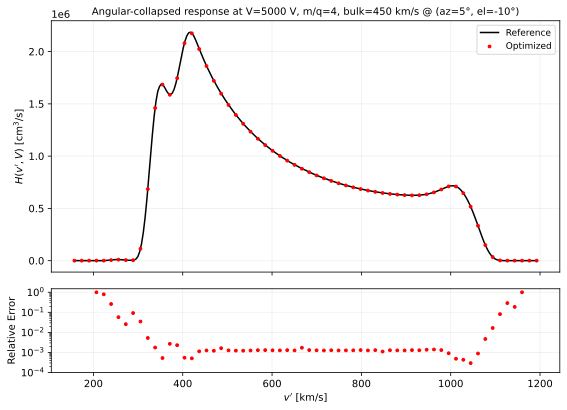
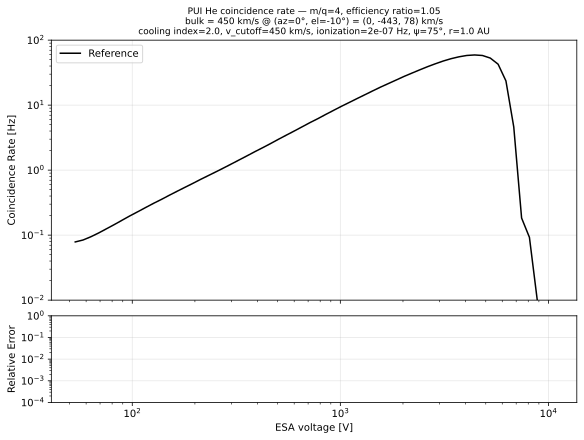

# SWAPI Pickup Ion L3A Data Product

## Introduction

After [fitting the proton distribution](./proton-sw.md) to the ten five-sweep chunks in a ten-minute chunk, the pickup ion (PUI) parameters are evaluated from the 50 sweeps by fitting a forward model.
The mean square difference between the model and observed rates, after averaging both over the 50 sweeps, is minimized.
Because statistics from individual sweeps are poor but the effects of the spacecraft spin do not cancel out on average, the model is evaluated based on the actual measurement times, then averaged over sweeps.
See the below figure for an example of the data used for the fit together with the fitted PUI forward model.


*Generated by `uv run scripts/swapi/view_one_pui_spectrum.py 2026-01-01 15:54:05 --output-path docs/swapi/figures/pui_flight_xarray_comparison.svg`, after running `scripts/swapi/fit_and_plot_pui.py 2026-01-01` to populate the fit caches.*

## Distribution Function

The PUI model is a generalized filled-shell distribution for PUIs at position $(r, \psi)$ in the solar inertial frame ([Rankin et al. 2025](https://doi.org/10.1007/s11214-025-01229-8)):
```math
f_\text{PUI}\!\left( r, \psi, w \right)
    = \frac{\alpha_{\text{PUI}}}{4\pi}
      \cdot
      \frac{\beta_{E} r_E^2}{r v_\text{sw} v_{b}^3}
      \cdot
      w^{\alpha_{\text{PUI}} - 3}
      \cdot
      n (r w^{\alpha_{\text{PUI}}}, \psi)
      \cdot
      \Theta(1 - w),
```
The free parameters are:

* Cutoff speed $v_{b}$.
* Ionization rate $\beta_{E}$.

The additional terms are:

* The cooling index, assumed to be the adiabatic-case $`\alpha_\text{PUI} = 1.5`$.

* $`v_\text{sw}`$ is the solar wind speed in the inertial frame.
* $`w_k \equiv v'/v_{b}`$, where $`v' \equiv \|\mathbf{v} - \mathbf{v}_\text{sw}\|`$ is the speed in the solar-wind frame.
* $n(r, \psi)$ is the density of interstellar neutrals, precomputed in a lookup table ancillary file using the hot model of [Thomas (1978)](https://doi.org/10.1146/annurev.ea.06.050178.001133).
* $r_E \approx 1\,\text{au}$.

Below, we show examples of the distribution for various cooling indices.
> 
> 
> *Generated by `docs/swapi/figure_src/plot_pui_distribution.py`.*

> **Note**: The density of neutral helium is not specified below 0.1 au, so linear interpolation is used below that point assuming that it is 0 at 0 au. That results in the discontinuity in the distribution curves in the plot above.

The PUI density and temperature are recovered as velocity moments of the fitted distribution,
```math
n_\text{PUI} = 4\pi \int_0^{v_\text{cut}} v'^{\,2} \, f_\text{PUI}(v') \; \mathrm{d}v',
\qquad
T_\text{PUI} = \frac{m}{3 k_B}
  \frac{\int_0^{v_\text{cut}} v'^{\,4} \, f_\text{PUI}(v') \; \mathrm{d}v'}
       {\int_0^{v_\text{cut}} v'^{\,2} \, f_\text{PUI}(v') \; \mathrm{d}v'}.
```

## Model Inputs

The PUI fitting procedure is applied to ten-minute chunks, each chunk containing fifty 12-second sweeps, each sweep having 72 ESA steps.
The [proton model](./proton-sw.md) is fit to each one-minute chunk within the ten-minute chunk and then the mean of the fitted proton parameters is used to inform the PUI model.

For each sweep $i \in \{1, \dots, 50\}$ and step $j \in \{1, \dots, 62\}$, the PUI fitting procedure takes:
- ESA voltage $V_j$;
- Measured coincidence rate $C_{ij}$;
- Chunk-mean proton solar wind bulk velocity vector rotated from RTN to instrument coordinates $\mathbf{v}_{\text{sw},ij}$.

For PUIs, only the coarse steps are used. Furthermore, the energy range is limited as follows (where $`E_\text{p}`$ is the proton kinetic energy corresponding to the provided proton solar wind bulk speed in the Sun's reference frame):
- Upper limit: the approximate $`\mathrm{He^+}`$ pickup ion cutoff, $`16 E_\text{p}`$ (accounts for the mass per charge being 4x higher and the cutoff speed being twice the solar wind speed, or four times the energy per charge, in the spacecraft frame).
- Lower limit: the geometric mean of the nominal alpha peak, $`2 E_\text{p}`$ (assuming the alpha solar wind shares the proton bulk speed), and the nominal PUI cutoff.

## Collapsed Instrument Response

To model the coincidence rate requires integrating the product of the differential flux with [the instrument response](./response.md):
```math
C_\text{PUI}(V) = \int \text{d}^3v \thinspace  v \thinspace  f_\text{PUI}(\mathbf{v})  \mathcal{A}^{s}(\mathbf{v}, V).
```

$`f_\text{PUI}`$ is isotropic in the solar wind's comoving frame (where $\mathbf{v}_\text{sw} = 0$).
Thus, one can change variables $`\mathbf{u} \equiv \mathbf{v} - \mathbf{v}_\text{sw}`$ ($`\mathrm{d}^3v = \mathrm{d}^3u`$, $`v' = |\mathbf{u}|`$), using $`\mathrm{d}^3u = v'^{\,2}\,\mathrm{d}v'\,\mathrm{d}\omega_u`$ ($\int \mathrm{d}\omega_u = 4\pi$), resulting in the 1D integral 
```math
C_\text{PUI}(V) = \int_0^\infty v'^{\,2}\,\mathrm{d}v' \; f_\text{PUI}(v') \, H(v', V; \mathbf{v}_\text{sw}),
```
where
```math
H(v', V; \mathbf{v}_\text{sw}) \;\equiv\; \int \mathrm{d}\omega_{u} \; |\mathbf{v}|\, \mathcal{A}(\mathbf{v}, V)
```
is the angular integral of $`|\mathbf{v}|\,\mathcal{A}`$ on the spherical shell defined by $`|\mathbf{v}-\mathbf{v}_\text{sw}|=v'`$, with dimensions of volume per time.
We can convert the angular integral to a velocity integral as follows:
```math
H(v', V; \mathbf{v}_\text{sw}) = \int \mathrm{d}^3 v \; \frac{\delta(v' - \| \mathbf{v} - \mathbf{v}_\text{sw} \|)}{v'^2} \, |\mathbf{v}|\, \mathcal{A}(\mathbf{v}, V)
```

In spherical instrument coordinates:
```math
H(v', V; \mathbf{v}_\text{sw}) = \int \mathrm{d}v \, \mathrm{d}\theta \, \mathrm{d}\phi \; v^3 \cos\theta \; \frac{\delta(v' - \| \mathbf{v} - \mathbf{v}_\text{sw} \|)}{v'^2} \, \mathcal{A}(\mathbf{v}, V)
```

To make this integral easier to calculate, we can fix $v'$ and integrate over two coordinates from $(\theta, \phi, v)$.
We choose to integrate over $(\theta, v)$ so that we only need to interpolate the passband once for each region.

The term inside the delta function is satisfied when:
```math
v'^2
= v^2 + v_\text{sw}^2 - 2 v v_\text{sw} \cos\alpha,
```
where $\alpha$ denotes the angle between $\mathbf{v}$ and $\mathbf{v}_\text{sw}$, given by:
```math
\cos\alpha = \frac{v^2 + v_\text{sw}^2 - v'^2}{2 v v_\text{sw}}
= \sin\theta \sin \theta_b + \cos\theta \cos\theta_b \cos(\phi - \phi_b).
```

Solving for the $\phi$ term:
```math
\cos(\phi - \phi_b) = \frac{\cos\alpha - \sin\theta \sin\theta_b}{\cos\theta \cos\theta_b},
```
which has zero or two solutions (depending on whether the right-hand side lies in $[-1, 1]$):
```math
\phi_\pm = \phi_b \pm \arccos\!\left( \frac{\cos\alpha - \sin\theta \sin\theta_b}{\cos\theta \cos\theta_b} \right)
```
(The boundary case where the argument equals $\pm 1$ yields a single (degenerate) root $\phi_+ = \phi_-$ but can be ignored for integration purposes.)

Define $`R(\phi) \equiv \|\mathbf{v} - \mathbf{v}_\text{sw}\|`$ at fixed $(v, \theta)$. 
Using $`\delta(v' - R(\phi)) = \sum_\pm \delta(\phi - \phi_\pm) / |R'(\phi_\pm)|`$, the integral is reduced to:
```math
H(v', V; \mathbf{v}_\text{sw}) = \int \mathrm{d}v \int \mathrm{d}\theta \; \frac{v^3 \cos\theta}{v'^{\,2}} \sum_\pm \frac{\mathcal{A}(v, \theta, \phi_\pm, V)}{|R'(\phi_\pm)|}.
```
Differentiating $`R^2(\phi) = v^2 + v_\text{sw}^2 - 2 v v_\text{sw} \cos\alpha(\phi)`$ with respect to $\phi$ gives
```math
2 R(\phi)\, R'(\phi) = 2\, v\, v_\text{sw} \cos\theta \cos\theta_b \sin(\phi - \phi_b),
```
and $R(\phi_\pm) = v'$,
```math
|R'(\phi_\pm)| = \frac{v\, v_\text{sw} \cos\theta \cos\theta_b\, |\sin(\phi_\pm - \phi_b)|}{v'}.
```
Substituting $|R'(\phi_\pm)|$ into the integral:
```math
H(v', V; \mathbf{v}_\text{sw}) = \int \mathrm{d}v \int \mathrm{d}\theta \; \frac{v^2}{v_\text{sw}\, v' \cos\theta_b} \sum_\pm \frac{\mathcal{A}(v, \theta, \phi_\pm, V)}{|\sin(\phi_\pm - \phi_b)|},
```

Below, we compare this optimized calculation of $H$ to a direct shell quadrature integral.



*Generated by `docs/swapi/figure_src/plot_collapsed_response_grid.py`.*

## Numerical Integration

The integration weight tensor $W_{ijk}$
```math
W_{ijk} = \Delta v' \cdot {v'_k}^2 \cdot H(v'_k, V_j; \mathbf{v}_\text{sw,ij}).
```
is precomputed on a uniform grid $v'_k \in [v'_\text{min}, v'_\text{max}]$ of 512 points with spacing $\Delta v'$, defined by
```math
v'_\text{max} = 1.1 \times 1.5 \, v_\text{sw},
```
```math
v'_\text{min} = 10^{-3} v'_\text{max}.
```
The upper boundary is the largest cutoff speed the good-fit criteria accept ($1.5 \, v_\text{sw}$), plus 10% so the optimizer sees the model change with the cutoff speed just past the upper limit. The lower boundary is a small fraction of the upper boundary to avoid singularities (${v'}^2$ integration weight suppresses the low-$v'$ contribution, so extending to zero is not necessary).

Using $W_{ijk}$, the model coincidence rate is given by
```math
C_{ij}^\text{(model)}(\mathbf{x}) = C_\text{bg} + \sum_k W_{ijk} f_\text{PUI}(v'_k; \mathbf{x}),
```
a single tensor operation after evaluating $`f_\text{PUI}(v'_k; \mathbf{x})`$ on the grid only one time for all sweeps and steps.
Here $`C_\text{bg} = 0.1`$ Hz is the instrument background, assumed constant.

It is essential to ensure continuity in derivatives with respect to the cutoff speed $v_b$ despite the discrete grid so that uncertainties can be estimated.
The numerical integration setup is equivalent to a midpoint rule, so $v'_j$ represents the bin center.
Instead of evaluating the Heaviside step function when calculating $`f_\text{PUI}`$ based on $\Theta(v'_j - v_b)$ alone, it is applied based on the fraction of the cutoff bin that is within the cutoff.
The exact index of the bin containing the cutoff point is
```math
j_\text{cutoff} = \text{round}\left( \dfrac{v_b - v'_0}{\Delta v'} \right).
```
The fraction of this bin that is below the cutoff is
```math
\dfrac{v_b - \left( v'_{j=j_\text{cutoff}} - \frac{\Delta v'}{2} \right)}{\Delta v'}.
```
Therefore, we simply scale $f_\text{PUI}$ in the cutoff bin by that factor, and set bins above the cutoff to zero. The below plot confirms that this approach accurately corrects the cutoff discretization even at an ESA voltage that is strongly affected by the cutoff.


*Generated by `docs/swapi/figure_src/plot_pui_cutoff_staircase.py`.*


Below, the optimized 1D integral is validated by comparing it to a reference 3D integral with automatic handling of units via `pint` and dimensionality using `xarray`.



*Generated by `docs/swapi/figure_src/plot_pui_reference_comparison.py` from `tests/test_data/swapi/pui_count_rate_reference.csv`.*

## Optimization Strategy

The free parameters are $\mathbf{x} = (\ln(\beta_E / \text{s}^{-1}), \ln(v_b/[\text{km}/\text{s}]))$.
They are parameterized in log space to ensure that they remain positive, but no other constraints are imposed.
The initial values are given by the table below.

| Parameter | Initial |
|---|---|
| $\beta_E$ | $10^{-7}\;\text{s}^{-1}$  |
| $v_b$ | $v_\text{sw}$ (Sun frame) |

The model $C^\text{(model)}_{ij}(\mathbf{x})$ is evaluated for each measurement time (sweep $i$, step $j$) within the ten-minute chunk.
The optimal parameters are found by minimizing:

```math
\hat{\mathbf{x}} = \arg\min_{\mathbf{x}} \sum_j
\left(
  \sum_i C^\text{(model)}_{ij}(\mathbf{x}) - \sum_i C_{ij}
\right)^2,
```

> **Note**: Inverse variance weighting is intentionally unused to avoid giving extra weight to other populations beyond the cutoff.
> The drawback of this approach is that it does not account for Poisson noise.
> To mitigate this problem, minimization takes place after averaging across sweeps to minimize the influence of Poisson noise on the fit.

To estimate the uncertainty, the [HC3 method](./parameter-uncertainty.md) is used with a finite-difference approximation to the Jacobian.

## Failure Cases

The fit-quality evaluation uses a model-derived upper energy boundary, $E_{1/4}$.
This is the highest energy at which the modeled PUI rate, summed over sweeps and excluding background, is at least 25% of its peak:
```math
C_{\max}^{\mathrm{(PUI)}} \equiv \max_j \sum_i C^\text{(PUI)}_{ij},
\qquad
E_{1/4} \equiv \max \left\{ E_j \;:\; \sum_i C^\text{(PUI)}_{ij} \ge \tfrac{1}{4} C_{\max}^{\mathrm{(PUI)}} \right\},
```
where $`C^\text{(PUI)}_{ij} \equiv C^\text{(model)}_{ij} - C_\text{bg}`$ is the modeled PUI rate with the background removed.
Both maxima include all coarse energy steps above the lower fitting boundary, without the nominal $`16 E_\text{p}`$ upper limit. Thus, $E_{1/4}$ may lie beyond the nominal cutoff.

Instead of requiring the fit to be good beyond the cutoff, it is only required that the fit is accurate up till the cutoff.
A separate metric requires that although the fit may not be good for points beyond the cutoff, the cutoff must be sufficiently sharp.
The motivation for this approach is that the isotropic model used is only expected to be accurate up till the cutoff.
After the cutoff, other populations are often visible, and anisotropy has a greater effect.

For the points between the lower fitting boundary and $E_{1/4}$, the mean relative error $\Delta_\text{rel}$ is defined as:
```math
\Delta_\text{rel} \equiv \frac{1}{N_j} \sum_j \frac{\lvert \sum_i C_{ij}^\text{(model)} - \sum_i C_{ij} \rvert}{\sum_i C_{ij}^\text{(model)}},
```
where the sum runs over the $N_j$ ESA steps included in the goodness-of-fit range. The model rate is used in the denominator because the observed rate can be zero.

To measure the sharpness of the cutoff, the past-peak ratio $`R_\text{past peak}`$ compares the mean observed rate above $E_{1/4}$ to the peak model rate:
```math
R_\text{past peak} \equiv \frac{1}{N_\text{past}} \sum_{j \,:\; E_j > E_{1/4}} \frac{\sum_i C_{ij}}{C_{\max}^{\mathrm{(PUI)}}},
```
where the sum runs over the $`N_\text{past}`$ ESA steps above $E_{1/4}$.

If the criteria below are not met, then the `BAD_FIT` flag is set and fill values are reported.
1. $v_b \le 550 \; \text{km/s}$ (to ensure that cutoff is actually in the instrument's energy range)
2. $R_\text{past peak} \le 0.4$ (to ensure the cutoff is sufficiently sharp)
3. $\Delta_\text{rel} \le 0.12$ (to ensure the model matches the shape of the distribution sufficiently well)
4. $0.5 \, v_\text{sw} \le v_b \le 1.5 \, v_\text{sw}$ (to ensure the cutoff speed is reasonably close to the solar wind speed)
5. $0.6 \times 10^{-9} \; \text{s}^{-1} \le \beta_E \le 8 \times 10^{-7} \; \text{s}^{-1}$ (to ensure the ionization rate is physically reasonable)
6. The fit and uncertainty estimation must not fail

## Numerical Test

Shown below is an experiment validating that the fitting algorithm recovers the ground truth parameters and accurately estimates the uncertainty given an ideal model with Poisson noise added.


*Generated by `docs/swapi/figure_src/plot_pui_mc_validation.py` from `tests/test_data/swapi/pui_count_rate_reference_50sweep.h5`.*
