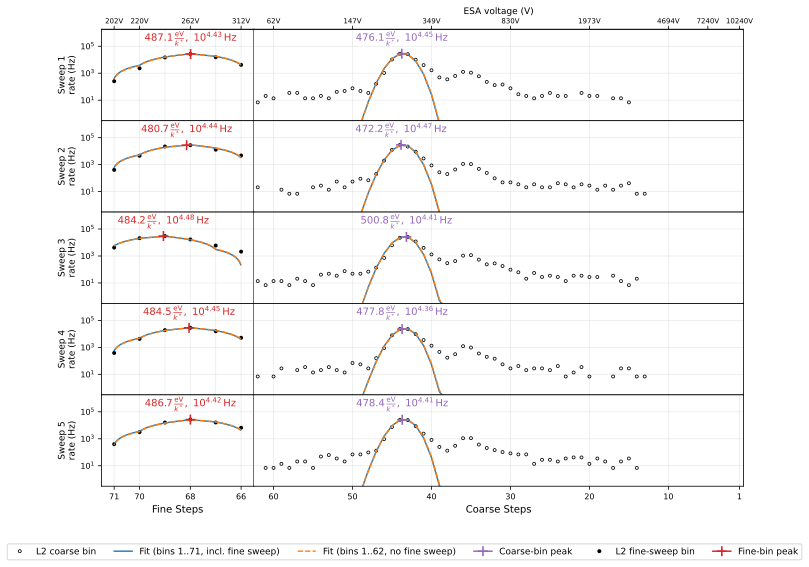

# SWAPI Proton Solar Wind Data Product

## Introduction

First, a representative SWAPI solar wind proton fit is shown below:



The fitted moments and their 1σ uncertainties are:

<!-- BEGIN: real_data_table (auto-generated by docs/swapi/figure_src/plot_real_data_fit.py — do not edit by hand) -->
| Quantity | SWAPI all ESA steps | bootstrap σ | coarse steps only | WIND/SWE 2-min @ 22:49:48 UT |
|---|---:|---:|---:|---:|
| Density $`n`$ (cm⁻³) | 5.118 ± 0.094 | ± 0.098 | 5.086 ± 0.134 | 5.710 ± 0.053 |
| Temperature $`T`$ (K) | $`(1.740 \pm 0.069)\times10^{4}`$ | $`\pm 0.073\times10^{4}`$ | $`(1.755 \pm 0.101)\times10^{4}`$ | $`(2.096 \pm 0.41)\times10^{4}`$ |
| Inertial-frame $`\lvert v \rvert`$ (km/s) | 307.1 ± 0.26 | ± 0.27 | 307.2 ± 0.34 | 333.6 ± 6.40 |
| $`v_{R}`$ (km/s, inertial RTN) | 307.05 ± 0.26 | ± 0.27 | 307.17 ± 0.41 | +333.30 ± 6.40 |
| $`v_{T}`$ (km/s, inertial RTN) | +3.63 ± 1.30 | ± 1.28 | +5.96 ± 2.16 | +12.70 ± 1.00 |
| $`v_{N}`$ (km/s, inertial RTN) | -2.61 ± 1.38 | ± 1.38 | -3.69 ± 1.85 | -0.30 ± 1.00 |
<!-- END: real_data_table -->

The reported uncertainties come from an approximate covariance matrix that accounts for heteroscedasticity.
The bootstrap $\sigma$ column provides a nonparametric estimate of the uncertainty.

WIND measurements at around the same time are included for comparison.
The velocity components are computed from the GSE components via $`v_{R} \approx -V_{x,\text{GSE}},\thinspace  v_{T} \approx -V_{y,\text{GSE}},\thinspace  v_{N} \approx V_{z,\text{GSE}}`$.
Differences between the spacecraft measurements include systematic effects such as spatial separation and temporal variation of the solar wind.

*The figure and table are generated by `docs/swapi/figure_src/plot_real_data_fit.py`.*

## Input Data

### SWAPI L2

The main input is the SWAPI L2 science data.
The L2 CDF files have rows representing 12-second sweeps and fields:

- `swp_coin_rate` — coincidence count rate (Hz) for each ESA step.
- `esa_energy` — energy-per-charge setting for each ESA step, related to the ESA voltage setting by $`k_{\text{L2}} = 1.93`$ eV/V/e.
- `sci_start_time` — beginning time of the 12-second sweep.

Each 12-second ESA sweep contains **72 ESA steps** (indices 0–71). Their roles are:

| Indices | # Steps | Description |
|---------|-------|-------------|
| 0       | 1     | **Always discarded.** Voltage ramp-up step. |
| 1–62    | 62    | **Coarse steps.** Fixed ESA voltage steps with logarithmic spacing, ordered from high to low voltage. |
| 63–71   | 9     | **Fine steps.** Instrument mode dependent, but they usually provide a higher-resolution scan of the proton peak. |

Both the coarse and fine steps are used, since the fine steps are usually concentrated near the proton peak.
Sometimes, one or more fine steps will have zero ESA voltage; these are excluded from the fit.

The 12-second sweeps are grouped into non-overlapping five-sweep chunks (resulting in a one minute cadence for the final output). Five sweeps are used because that corresponds to the least common multiple of the spin rate (approximately 15 seconds) and the sweep cadence (12 seconds).
This chunking approach is used because the spin variation makes it possible to determine the bulk velocity of the solar wind.

### SPICE Kernels

To associate measurements with the spacecraft orientation at that time that the measurement was taken, it is necessary to evaluate the exact time each measurement was taken.
The start time for each $12\,\text{s}$ sweep, denoted $`t_{\text{start}}`$, is available from the CDF (`sci_start_time`).
The start time for step $i \in [0, 71]$ is thus given by
```math
t_{i,\text{start}} = t_\text{start} + i \cdot \frac{12}{72}\,\text{s} 
```

Counts accumulate during the $`145\,\text{ms}`$ livetime at the end of each $`\frac{12}{72}\,\text{s} = 166.\overline{6}\,\text{ms}`$ step.
The flight software ensures that the beginning and end of this window is consistent to within a few milliseconds.
Setting the measurement time of each ESA step $t_i$ to the center of that livetime:
```math
t_i
= t_{\text{start}} + (i + 1) \cdot 166.\overline{6}\,\text{ms} - 145\,\text{ms}
```
The SWAPI-to-RTN rotation matrices are obtained from the SPICE kernels for each $`t_i`$.
These are used directly in the forward modeling processing.
If the rotation matrices are unavailable, the chunk is skipped and assigned fill values.

The spacecraft velocity in the Sun's inertial frame is also obtained for the center of each chunk, which is used to transform the final bulk velocity vector.
If uavailable, the fit is still performed, but the Sun-frame outputs cannot be computed.

## Optimization Procedure

The proton model parameters are represented by the vector
```math
\mathbf{x} = (\ln n,\thinspace  \ln T,\thinspace  v_{R},\thinspace  v_{T},\thinspace  v_{N}).
```
$\ln n$, $\ln T$ represent the density and temperature in log space (so that the density and temperature are always positive).
$v_{R}, v_{T}, v_{N}$ represent the bulk velocity vector in the spacecraft's frame of reference, denoted $\mathbf{v}_{b}^{\text{SC}}$.
The optimal parameters are found by solving the minimization problem
```math
\hat{\mathbf{x}} = \arg\min_{\mathbf{x}} \sum_{i} \left[\thinspace  C_{i}^{\text{observed}}(\mathbf{x}) - C_{i} \thinspace \right]^{2},
```
where $`C_{i}`$ is the coincidence rate measurement index for measurement $i$ and $`C_{i}^{\text{observed}}(\mathbf{x})`$ is the [model coincidence rate](./solar-wind-forward-model.md).

The residuals are intentionally left unweighted.
Because Poisson variance is proportional to count rate, inverse-variance weighting would give extra weight to low-count points away from the peak.
That is a problem because other populations (e.g., the proton shoulder, pickup ions, and alpha particles) contribute significantly to the total count rate away from the peak.
For SWAPI this is a particularly noticeable effect because the sunglasses attenuate the cold, core solar wind population and thus magnify the relative contribution of high-temperature secondary proton populations.

## Initial Guess

The bulk speed is first set to $`v_{b}^{(0)}`$, the speed corresponding to the peak coincidence rate.
The temperature is first set to:
```math
T^{(0)} = \text{max}\negthinspace \left(1\thinspace \text{eV} / k_B, 60{,}000\thinspace \text{K} \cdot \left(\dfrac{v_{b}^{(0)}}{400\thinspace \text{km/s}}\right)^{2}\right).
```

$`v_{b}^{(0)}`$ and $`T^{(0)}`$ are then refined by fitting an arbitrarily normalized Gaussian curve:
```math
C(V) \propto \exp\!\left( -\dfrac{(v_0(V) - \mu_v)^2}{2 \sigma_v^2} \right)
```
after which $`v_b^{(0)} = \mu_v`$, $`T^{(0)} = \text{max}(1\thinspace \text{eV}, m\sigma_{v}^{2} / k_{B})`$, and:
```math
\mathbf{v}_{b}^{\text{SC,(0)}} = -v_{b}\thinspace \hat{\mathbf{y}}^{\text{RTN}}.
```
```math
n^{(0)} = \arg\min_{n} \sum_{i} \left[\thinspace  n\thinspace m_{i}\thinspace \mathcal{D}(n\thinspace m_{i}) - C_{i} \thinspace \right]^{2}, \qquad m_{i} = C_{i}^{\text{model}}(n = 1; T^{(0)}, \mathbf{v}_{b}^{\text{SC,(0)}}).
```
where $`\hat{\mathbf{y}}^{\text{RTN}}`$ is the normalized mean $y$-axis basis vector in RTN coordinates (taken from the rotation matrices).
By design, the solar wind bulk velocity direction is close to $`-\hat{\mathbf{y}}^{\text{RTN}}`$ on average.

## Escaping Local Minima

The mean squared error function often has a local minimum with bulk velocity flipped about the spin axis $`\hat{\mathbf{s}}^{\text{RTN}}`$.
Fortunately, the local minimum has a much larger mean squared error (MSE) than the global minimum.
After obtaining the parameters and MSE from the first minimum ($`\mathbf{v}_{b}`$, $`n`$, $`T`$, and $`\text{MSE}`$), the following procedure is repeated up to six times:

1. **Flip the bulk velocity, rescale the density.**
   ```math
   \mathbf{v}_{b}^{\text{flip}} = 2\thinspace \hat{\mathbf{s}}\thinspace (\hat{\mathbf{s}}\cdot\mathbf{v}_{b}) - \mathbf{v}_{b},
   ```
   ```math
   n^{\text{flip}} = \arg\min_{n} \sum_{i} \left[\thinspace  n\thinspace m_{i}\thinspace \mathcal{D}(n\thinspace m_{i}) - C_{i} \thinspace \right]^{2}, \qquad m_{i} = C_{i}^{\text{model}}(n = 1; T, \mathbf{v}_{b}^{\text{SC,(k)}}).
   ```
2. **Check the threshold.** If $`\sqrt{\text{MSE}^{\text{flip}}} \geq 10 \sqrt{\text{MSE}}`$, stop iterating.
3. **Fit again if within the threshold.** Now the starting point for the fit is $`(\mathbf{v}_{b}^{\text{flip}}, n^{\text{flip}}, T)`$.
4. **Compare the two fits.** If the MSE at the new local minimum is no worse than it was at the previous local minimum, accept the new solution and continue iterating.

## Numerical Validation

To validate that the algorithm works correctly under realistic conditions, the following experiment was performed:

1. Sample 10,000 solar wind parameters from WIND/SWE's nonlinear Maxwellian fits in 2025.
2. Simulate realistic input data for each: 5 sweeps, 62 ESA steps each (if the fine sweeps were included too, it would only improve the result); rotation matrices with realistic spacecraft spin; and forward-modeled coincidence rates using the same model used for fitting, but with Poisson noise added.
3. Apply the algorithm to the simulated coincidence rates, yielding estimates for the solar wind proton parameters.


*Generated by `docs/swapi/figure_src/plot_fit_accuracy.py`.*

## Error/Uncertainty Quantification

The covariance matrix of the fitted parameters, $`\Sigma_\mathbf{x}`$, is estimated with the [HC3 method](./parameter-uncertainty.md), since the residuals are [intentionally left unweighted](#optimization-procedure).
The [analytic Jacobian](./solar-wind-forward-model.md#analytic-jacobian) of the forward model is used.

The figure below validates the uncertainty estimate empirically.
The ground truth ($`n = 5\thinspace \text{cm}^{-3}`$, $`T = 10^{5}\thinspace \text{K}`$, $`\mathbf{v}_{\text{RTN}} = (450, 5, -3)\thinspace \text{km/s}`$), so there is one true coincidence rate spectrum.
1000 synthetic 5-sweep chunks are generated by adding Poisson noise, 1\% log-normal noise, and an energy-independent, Poisson-distributed 10 Hz background.


*Generated by `docs/swapi/figure_src/plot_uncertainty_mc.py`.*

## Failed fits

- If the optimizer reports `success=False`, or any error occurs, the flag `FIT_ERROR` is set and fill values are reported.
- If $R^2 < 0.9$ or $T > 5 \times 10^5\,\text{K}$, the flag `BAD_FIT` is set and fill values are reported.

$R^2$ is computed using only the measurements within $\pm 4$ points of the peak after averaging the spectrum across the five sweeps (retaining only the coarse-sweep bins, since the fine sweeps have a different energy in each sweep).
The coincidence rates are averaged across sweeps before computing $R^2$ because individual sweeps have lower $R^2$ due to the solar wind's variability on short timescales.
The $R^2$ check is intended to confirm that the model, which assumes that the distribution is unchanging over the one-minute chunk, is a reasonable representation of the one-minute average distribution, rather than testing whether it captures all of the temporal variation.

Whenever the fit fails and fill values are reported, `proton_sw_speed` is still populated based on the peak of the sweep-averaged coincidence rates.
The peak is identified by using a coincidence rate-weighted average.

## CDF Outputs

The `proton-sw` CDF variables are derived from $`\mathbf{x}`$ and $`\Sigma_\mathbf{x}`$ as follows:

| CDF variable                                  | Symbol                  | Definition                                                                                            |
|-----------------------------------------------|-------------------------|-------------------------------------------------------------------------------------------------------|
| `epoch`                                       | $`t_{\text{center}}`$       | center time of the 5-sweep chunk                                                          |
| `epoch_delta`                                 |                         | $`30\thinspace \text{s}`$ (half-width of the 5-sweep chunk)                                               |
| `proton_sw_density`                           | $`n`$                     | $`\exp(x_{0})`$                                                                                           |
| `proton_sw_density_uncert`                    | $`\sigma_{n}`$              | $`n\thinspace \sqrt{\Sigma_{\mathbf{x}}[0, 0]}`$                                                                             |
| `proton_sw_temperature`                       | $`T`$                     | $`\exp(x_{1})`$                                                                                           |
| `proton_sw_temperature_uncert`                | $`\sigma_{T}`$              | $`T\thinspace \sqrt{\Sigma_{\mathbf{x}}[1, 1]}`$                                                                             |
| `proton_sw_velocity_rtn`                 | $`\mathbf{v}_{b}^{\text{SC}}`$ | $`(x_{2},\thinspace  x_{3},\thinspace  x_{4})`$                                                                                |
| `proton_sw_velocity_rtn_covariance`   | $`\Sigma_{\mathbf{v}}`$              | $`\Sigma_\mathbf{x}[2{:}5,\thinspace 2{:}5]`$ <sup>[1](#fn-velcov)</sup>                                                  |
| `proton_sw_velocity_rtn_uncert`       | $`\sigma_{\mathbf{v}_{b}}`$         | $`\sqrt{\operatorname{diag}(\Sigma_{\mathbf{v}})}`$ <sup>[1](#fn-velcov)</sup>                                            |
| `proton_sw_speed`                             | $`\lvert\mathbf{v}_{b}^{\text{SC}}\rvert`$ | $`\lvert\mathbf{v}_{b}^{\text{SC}}\rvert`$                                                                  |
| `proton_sw_speed_uncert`                      | $`\sigma_{\lvert\mathbf{v}_{b}^{\text{SC}}\rvert}`$ | propagated through `uncertainties` from $`\mathbf{v}_{b}^{\text{SC}}`$                            |
| `proton_sw_velocity_rtn_sun`             | $`\mathbf{v}_{b}^{\text{sun}}`$ | $`\mathbf{v}_{b}^{\text{SC}} + \mathbf{v}_{\text{sc}}^{\text{sun}}`$ <sup>[2](#fn-vsc)</sup>                                          |
| `proton_sw_speed_sun`                         | $`v_{\text{sun}}`$          | $`\lvert\mathbf{v}_{b}^{\text{sun}}\rvert`$                                                                 |
| `proton_sw_speed_sun_uncert`                  | $`\sigma_{v_{\text{sun}}}`$ | propagated through `uncertainties` from $`\mathbf{v}_{b}^{\text{sun}}`$                                       |
| `swp_flags`                                   |                         | quality flag bitmask (see `SwapiL3Flags`)                                                            |


<a id="fn-velcov"></a>[1]: The square root of the diagonal of $`\Sigma_{\mathbf{v}}`$ yields the standard error of the $`v_{R}, v_{T}, v_{N}`$ components. The covariance is the same for `proton_sw_velocity_rtn_sun`.

<a id="fn-vsc"></a>[2]: $`\mathbf{v}_{\text{sc}}^{\text{sun}}`$ is the spacecraft velocity in the Sun's inertial frame.

