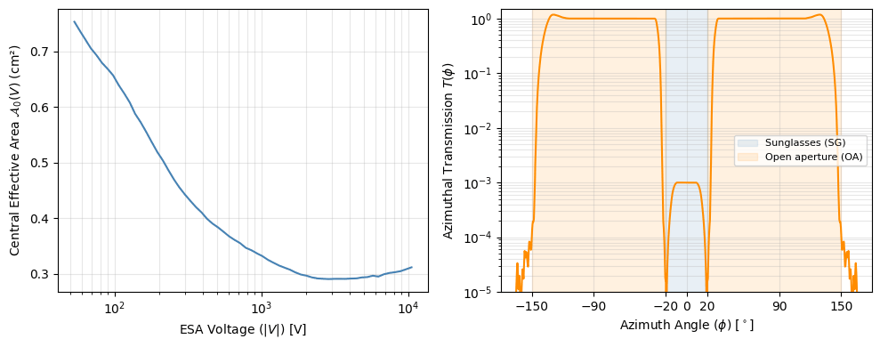
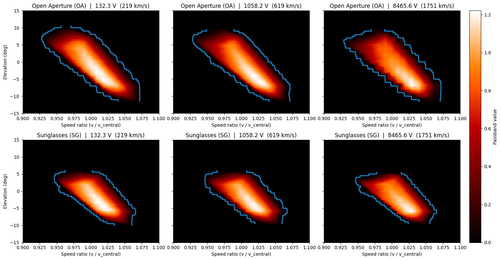
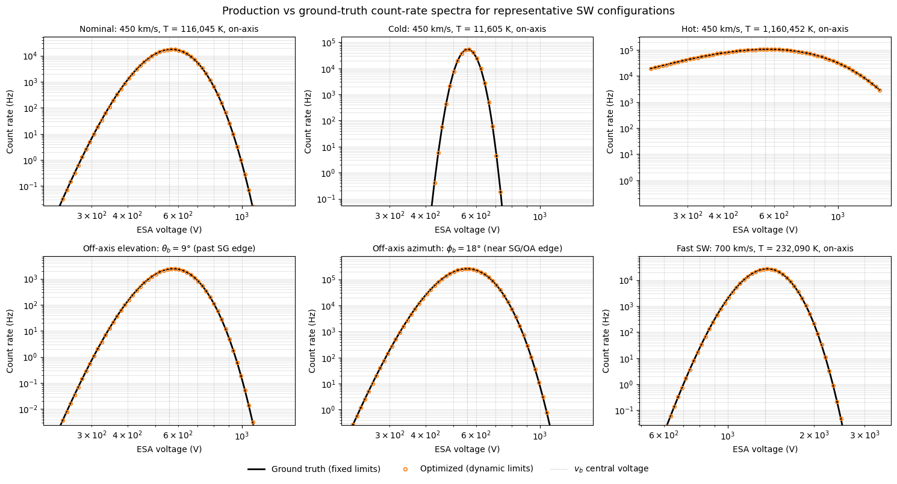
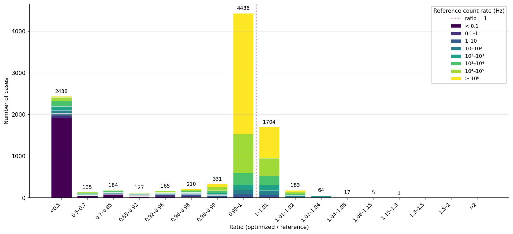
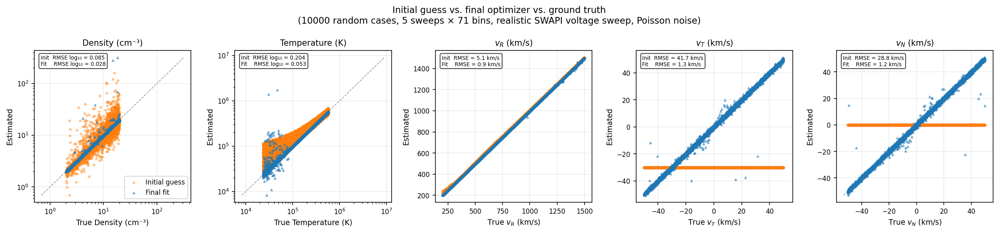
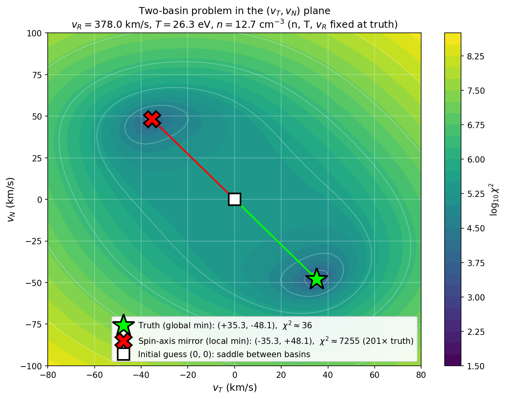
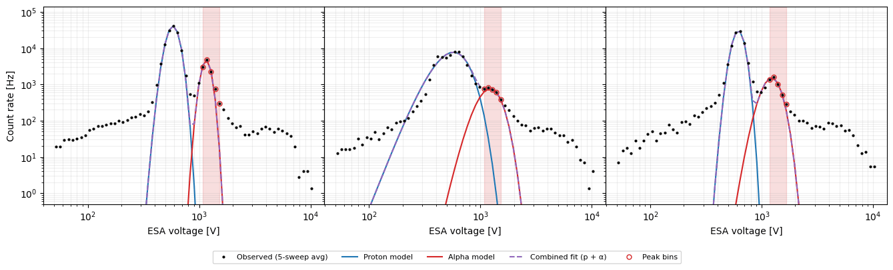

# SWAPI Solar Wind Moments Algorithm Notes

## Code Files

- `imap_l3_processing/swapi/l3a/science/swapi_response.py` — Instrument response model. Loads calibration tables (azimuthal transmission, central effective area, passband polynomial fits) and builds a `PassbandGrid` per ESA voltage step via `SWAPIResponse.create_passband_grid`.
- `imap_l3_processing/swapi/l3a/science/calculate_proton_solar_wind_moments.py` — Core proton fitting algorithm. `fit_solar_wind_proton_moments` implements the three-step procedure (SPICE → initial guess → Levenberg–Marquardt); `calculate_integral` is the Numba-JIT count-rate integral over elevation, azimuth, and speed.
- `imap_l3_processing/swapi/l3a/science/calcxwulate_alpha_solar_wind_moments.py` — Alpha particle moments fitter (Stage 2 of the two-stage proton-frozen scheme). `fit_solar_wind_alpha_moments` fits $(n_\alpha, T_\alpha, \Delta v)$ with proton parameters held fixed.
- `imap_l3_processing/swapi/l3a/science/speed_calculation.py` — ESA step layout constants (`SWAPI_SCIENCE_BINS`, `SWAPI_COARSE_SWEEP_BINS`, `SWAPI_FINE_SWEEP_BINS`), k-factor constants, `esa_voltage_to_proton_speed`/`esa_voltage_to_alpha_speed` conversions, and `get_alpha_peak_indices` for locating the alpha bump in the count-rate spectrum.
- `imap_l3_processing/swapi/swapi_processor.py` — Production pipeline entry point. Dispatches on descriptor (`proton-sw`, `alpha-sw`, `pui-he`). Each product's processing method precomputes SPICE geometry, then distributes 5-sweep chunks across a `ProcessPoolExecutor` (fork-based multiprocessing). Module-level worker functions (`_proton_chunk_worker`, `_alpha_chunk_worker`, `_pui_proton_chunk_worker`) receive shared state (`SWAPIResponse`, `EfficiencyCalibrationTable`, MAG data) via an initializer. `_derive_proton_velocity_angles` converts fitted RTN velocity to speed, clock angle, and deflection angle in the DPS frame with delta-method uncertainty propagation.

## TODO

- [ ] Refactor code
- [ ] Review/rewrite tests
- [ ] Validate uncertainty
- [ ] Clarify behavior of partial last chunk from `chunk_l2_data` — if the day's sweep count isn't a multiple of 5, the final group has fewer sweeps and its epoch (`sci_start_time[0] + 30s`) is off-center; decide whether to drop it, pad it, or accept the timestamp offset
- [ ] Efficiency stuff
      > Determine alpha efficiency. Maybe empirically validate alpha-species correction $\mathcal{A}_0^\alpha/\mathcal{A}_0^p = \varepsilon_\alpha/\varepsilon_p$ against OMNI alpha density (the paper does not prove this; alpha ABM measurements weren't taken)
      > Coordinate with cal-file format owner to add a `lab_time` field to the efficiency LUT.
      > Interim: `eps_p_lab` is pinned to the first row at/after 2025-11-01 because the pre-2025-11 rows in the current LUT are placeholder values (0.02348 repeated) and using them as the lab denominator drove proton density 6× too low.
      > Replace with the proper `lab_time` lookup once the LUT format gains the field (see `EfficiencyCalibrationTable.eps_p_lab`).
- [ ] Choose bad fit flags
      > Daily repointing data gaps
      > High temperature (but still report speed and maybe pressure, too)
- [ ] Handle the padded SWAPI vs unpadded MAG data temporal mismatch
- [ ] Use L2 or L1D depending on what's available https://github.com/IMAP-Science-Operations-Center/imap_L3_processing/issues/13
- [ ] Investigate the degeneracy in clock angle at 8:11 on 2026-02-04

## Input Data

### L2 Science Data

The primary input for `SwapiProcessor` is SWAPI L2 coincidence count-rate data (`imap_swapi_l2_sci`). Each CDF contains time-ordered ESA sweeps with fields:

- `swp_coin_rate` — coincidence count rate (Hz) for each ESA step.
- `esa_energy` — energy-per-charge setting for each ESA step. It is related to the actual ESA voltage setting of the instrument by $k_\text{L2} = 1.93$ eV/V/e (see [Two k-factors](#two-k-factors)). To recover the ESA voltage: $V = -\texttt{esa\_energy} / k_\text{L2}$.
- `sci_start_time` — sweep start epoch (TT2000 ns)

Each 12-second ESA sweep contains **72 ESA steps** (indices 0–71). Their roles are:

| Indices | Count | Description |
|---------|-------|-------------|
| 0       | 1     | **Always discarded.** Voltage step-up sweep. |
| 1–62    | 62    | **Coarse sweep.** Fixed ESA voltage steps with logarithmic spacing. |
| 63–71   | 9     | **Fine sweep.** Depends on instrument mode, but usually provides a higher-resolution scan of the proton peak, using smaller voltage steps. |

To fit protons, we use both the coarse sweeps and the fine sweeps, since the fine sweeps usually provide extra information about the protons.
Occasionally, one or more fine sweep steps will have zero ESA voltage; these are excluded from the fit.
Likewise, only steps near the proton peak are included.
To fit alphas, we use only the coarse sweeps.
For both protons and alphas, most of the steps are discarded and only the few that are near the peak are actually used.

The CDF provides these 12-second sweeps for one day per file.
 `SwapiProcessor` groups sweeps into non-overlapping 5-sweep chunks (60s cadence), the least common multiple of the spin rate (approximately 15s) and the sweep cadence (12s).
The solar wind fitting algorithms are applied to these 5-sweep chunks individually.
The use of 5 sweeps makes it possible to determine the bulk velocity of the solar wind.

### SPICE Kernels

`SwapiProcessor` requires enough SPICE kernels to be furnished to obtain RTN to SWAPI instrument coordinate rotation matrices at each measurement time.
These are used to rotate the spacecraft-frame bulk velocity into instrument coordinates for the forward model.
It also uses the spacecraft velocity to convert the bulk velocity vectors to the Sun's inertial rest frame.

To get the spice kernel for each measured coincidence rate, the measurement time must be specified.
The start time for each sweep, available from the L2 CDF, is denoted $t_\text{epoch}$.
For ESA step $i$ (0-indexed, although recall that step 0 is skipped), the measurement time is:
$$t_i = t_\text{epoch} + i \cdot \tfrac{12}{72}\,\text{s} = t_\text{epoch} + i \cdot 0.1\overline{6}\,\text{s}.$$

### MAG L1D (alpha only)

The alpha moments fitter requires magnetic field direction from MAG L1D (`b_dsrf` in the despun spacecraft frame). Each MAG sample in the chunk's 60 s window ($\pm 30$ s around the chunk center, exactly the 5-sweep span) is rotated DSRF→RTN at its own epoch and the rotated vectors are averaged in RTN; the unit direction of that mean is then taken as $\hat{\mathbf{B}}^\text{RTN}$. Rotating per-sample before averaging preserves the spacecraft-attitude evolution across the window rather than collapsing it to a single chunk-center rotation. When MAG data is unavailable, a nominal Parker spiral direction is used as fallback (see [Quality flags](#quality-flags-alpha-specific)).

## SWAPI Response Model

The coincidence count rate at ESA voltage $V$ is
$$C(V) = \sum_s \int d^3v \; v \, f^s(\mathbf{v}) \, \mathcal{A}^s(\mathbf{v}, V),$$
where $f^s$ is the VDF of species $s$ and $\mathcal{A}^s$ is the effective area.

The effective area is decomposed as
$$\mathcal{A}^s(v, \theta, \phi, V) = \mathcal{A}_0^s(V) \cdot P\!\left(\dfrac{v}{v_0^s},\, \theta,\, \phi,\, V\right) \cdot T(\phi),$$
where:
- $v_0^s = \sqrt{2 k^* q^s |V| / m^s}$ is the central speed;
- $\mathcal{A}_0^s$ is the central effective area;
- $P$ is the energy-angle passband;
- $T$ is the azimuthal transmission factor.

Copies of these three functions in the form of CSV files are in `instrument_team_data/swapi`.

The normalization of $\mathcal{A}_0^s$ and $P$ are aligned in terms of the value at $\theta = 0$ and $k^* \equiv 1.89$ eV/V/e, the peak $E/|V|$ at $\theta=0^\circ$ based on high-resolution SIMION simulations.
It differs from $k_\text{L2} = 1.93$, which is the $k$-factor determined approximately from lab measurements (Rankin et al. 2025).
They differ primarily due to slight inaccuracy of the beam energy and orientation in the lab measurements. 

> 
> *Central effective area and azimuthal transmission.* [[src]](figure_src/plot_calibration_curves.py)

$T(\phi)$ and $\mathcal{A}_0^s(V)$ are 1D functions stored in simple CSV files with a uniform grid. They are interpolated linearly for practical usage. ESA voltages outside the tabulated range are clamped to the endpoint values.

> *Example passbands.* [[src]](figure_src/plot_passband_boundaries.py)

$P$ for a given $V$ is represented as a `PassbandGrid` object.
The CSV file contains polynomial fits of $\log P$ for each ($\theta$, $v/v_0$) pixel as a function of $\log(k^* |V|)$ with a separate fit for the open aperture ($|\phi| > 20°$ and sunglasses $|\phi| \leq 20°$).
`SWAPIResponse.create_passband_grid` constructs a `PassbandGrid` for an arbitrary $V$ by interpolating these fits evaluated at $V$ onto a uniformly spaced ($\theta$, $v/v_0$) grid ($\theta = −15°$ to $15°$ in 61 points with $0.5°$ spacing, $v/v_0 = 0.9$ to $1.1$ in 101 points) and stores the result in a `PassbandGrid` struct.
The uniform spacing is for computationally efficient interpolation.
When $V$ falls outside the range used to fit the polynomials in the CSV, it is silently clamped to the nearest endpoint.

`PassbandGrid` also keeps track of the integration contour: per-elevation speed-ratio bounds (`min_OA_boundary` / `max_OA_boundary` / `min_SG_boundary` / `max_SG_boundary`) plus a per-region elevation range (`oa_elevation_range` / `sg_elevation_range`).
The contour is set by a threshold of 1% of the maximum.
The boundary is the first grid point outside the above-threshold region in each row, and rows whose maximum falls below the threshold drop out entirely (tightening the elevation range too). Both the speed-ratio bounds and the elevation range are therefore $V$-dependent and recomputed inside `create_passband_grid` for every new $V$.
`SwapiProcessor` precomputes the grids for each L2 file before fitting the 5-sweep chunks.

## Solar Wind Model Count Rate Integral
The solar wind proton velocity distribution function (VDF) is modeled as a drifting Maxwellian. In instrument coordinates, it is parameterized by bulk velocity ($v_b, \theta_b, \phi_b$), temperature ($K$), and density ($n$).
The VDF is given by:
$$f_p(\mathbf{v}) = f_p(v, \theta, \phi) = \frac{n}{(\sqrt{2\pi}\, v_\text{th})^3} \exp\!\left(-\frac{v^2 + v_b^2 - 2 v\, v_b \cos\alpha(\theta, \phi)}{2 v_\text{th}^2}\right),$$
where $\cos\alpha = \sin\theta_b \sin\theta + \cos\theta_b \cos\theta \cos(\phi - \phi_b)$ and $v_\text{th} = \sqrt{k_B T/m_p}$.

Substituting into the count rate integral in spherical velocity coordinates $(v, \theta, \phi)$:
$$C(V) = \frac{n\, \mathcal{A}_0(V)}{(\sqrt{2\pi}\, v_\text{th})^3} \sum_\text{region} \int \cos\theta\, d\theta \int T(\phi)\, d\phi \int v^3\, P\!\left(\tfrac{v}{v_0}, \theta\right) \exp\!\left(-\frac{v^2 + v_b^2 - 2vv_b\cos\alpha}{2v_\text{th}^2}\right) dv.$$

The sum runs over three azimuth regions: sunglasses (SG, $|\phi| \leq 20°$), left open aperture (OA, $-150° < \phi < -20°$), and right open aperture ($20° < \phi < 150°$).
They are integrated separately so that only one passband is used for each integral and because the integral will generally have separate peaks in each of these regions due to the vanes at $\pm 20^\circ$.

### Angular limits

For each region, the $(\theta, \phi)$ integration window is built from an angular radius $\Delta\alpha$ around the bulk direction, then clamped to the region's geometric extent in $\phi$ and the V-dependent elevation range of the region's passband in $\theta$. Special treatment is given for the open aperture region's integration limit.

#### Angular radius

The VDF can be split into a speed factor and an angular factor (using $|\mathbf{v} - \mathbf{v}_b|^2 = (v - v_b)^2 + 2 v v_b (1 - \cos\alpha)$):
$$f(v, \alpha) \propto \exp\!\left(-\frac{(v - v_b)^2}{2 v_\text{th}^2}\right)\,\exp\!\left(\frac{v\,v_b\,(\cos\alpha - 1)}{v_\text{th}^2}\right),$$
where $\alpha$ is the angular distance from the bulk direction. $\Delta\alpha$ is defined as the value of $\alpha$ at which the angular factor drops to $\varepsilon$, evaluated at $v = v_0$ (the passband central speed, where the radial integrand is largest):
$$\Delta\alpha = \arccos\!\left(\mathrm{clamp}\!\left(\frac{v_\text{th}^2 \ln\varepsilon}{v_0 v_b} + 1;\; -1,\; 1\right)\right),$$
with $\varepsilon_\text{SG} = \varepsilon_\text{OA} = 10^{-6}$. For $v_0 \approx v_b$ this reduces to $\Delta\alpha \approx \sigma_\alpha\,\sqrt{-2\ln\varepsilon}$, where $\sigma_\alpha = v_\text{th}/v_b$ is the natural angular thermal width — about $5.26\,\sigma_\alpha$ at $\varepsilon = 10^{-6}$. Aside from potential numerical instability, the clamp is needed only for when $v_\text{th}$ is large enough relative to $\sqrt{v_0 v_b}$ to drive the cosine argument out of $[-1, 1]$, in which case $\Delta\alpha = 180^\circ$ and the entire region is integrated.

#### Per-region clamping

$\Delta\alpha$ is applied as a half-extent independently in $\theta$ and $\phi$ — a conservative choice, since the rectangle $[\theta_b \pm \Delta\alpha] \times [\phi_b \pm \Delta\alpha]$ contains the spherical disk of radius $\Delta\alpha$. The window is then clamped per region:

| Region | Azimuth Range |
|--------|----------------|
| SG     | $[-20°,\; 20°]$ |
| OA−    | $[-150°,\; -20°]$ |
| OA+    | $[20°,\; 150°]$ |

Azimuth is clamped to the geometric boundaries in the table above; elevation is clamped to the region's $V$-dependent passband elevation range.
If the gaussian window falls entirely outside either clamp — $[\theta_b \pm \Delta\alpha]$ outside the elevation range, or $[\phi_b \pm \Delta\alpha]$ outside the azimuth range — both clamped endpoints collapse to the same boundary and that dimension has zero width, so the region is skipped entirely.
This is primarily useful in that it skips the the open aperture integration most of the time, since the open aperture has no significant contribution to the total count rate under most solar wind conditions.

#### OA azimuth: integrand-aware trim

For OA, the gaussian-only $\Delta\alpha$ above is replaced by a transmission-aware scan (`_trim_oa_azimuth_by_integrand`). Motivation: $T(\phi)$ is essentially zero from $20°$ to $25°$ and only rises to its plateau by $30°$, so the standard $\Delta\alpha \approx 5.26\,\sigma_\alpha$ window routinely opens a 1°–10° sliver of OA where the integrand $\rho \times T \approx 0$ — wasting integration nodes on a dead zone. Conversely, when $\phi_b$ sits past $\sim 15°$, the OA window must extend well past $\Delta\alpha$ to capture the high-$T$ region where the gaussian tail times full transmission still contributes.

The trim works in three steps:

1. **Scan** $\rho(\phi) \cdot T(\phi)$ at $(\theta = \mathrm{clip}(\theta_b, \theta_\text{lo}, \theta_\text{hi}),\; v = v_0)$ across the full OA passband ($[20°, 150°]$ for OA+, $[-150°, -20°]$ for OA−), at adaptive spacing $\Delta\phi_\text{scan} = \mathrm{clip}(\sigma_\alpha / 2,\; 0.1°,\; 1°)$. Spacing tracks the gaussian width so cold-plasma peaks (sub-degree wide) aren't missed by a coarse grid. Clipping $\theta_b$ into the active elevation range puts the scan at the in-passband peak in the elevation direction.
2. **Skip** the OA region entirely if $\max(\rho T) < 10^{-9}$ — the gaussian tail is too far from any $\phi$ with meaningful transmission.
3. **Anchor** the integration window at the OA inner boundary ($\pm 20°$, on the SG side) and trim only the *far* end at the threshold $\rho T > 10^{-3} \times \max$. Anchoring is essential: $T(\pm 20°) = 0$ by construction, so the rising-edge peak (at $\sim \pm 21°$ for $\phi_b$ near zero) sits between the boundary and the first scan grid point that exceeds threshold; trimming the boundary side would cut off real signal.

For typical solar wind at $T \sim 100{,}000$ K and $|\phi_b| < 6°$, the trim collapses the OA window to a few degrees adjacent to the SG/OA transition. For high-deflection cases ($|\phi_b| > 15°$), the scan finds the peak at $\phi \sim 25°$–$30°$ and the trim returns essentially the same window as the gaussian-only $\Delta\alpha$ would. Median chunk fit time drops from ~963 ms (gaussian-only $\Delta\alpha$ feeding 41 OA azimuth nodes) to ~175 ms — a ~5.5× speedup with no loss of accuracy on the reference-integral histogram (max ratio error stays at 10% for low-rate edge cases, identical to the un-trimmed integrator).

### Speed limits

For each elevation node, the speed integration window is the intersection of the Maxwellian's effective support and the passband's per-elevation speed-ratio support:
$$v_\text{min}(\theta) = \mathrm{clip}\!\left(v_b - 10v_\text{th};\; r_\text{min}(\theta)\,v_0,\; r_\text{max}(\theta)\,v_0\right), \qquad v_\text{max}(\theta) = \mathrm{clip}\!\left(v_b + 10v_\text{th};\; r_\text{min}(\theta)\,v_0,\; r_\text{max}(\theta)\,v_0\right).$$
The $\pm 10\,v_\text{th}$ window is essentially the full Maxwellian support — the integrand at $10\sigma$ is below $e^{-50} \sim 10^{-22}$. When the Maxwellian and the passband don't overlap at a given elevation, both clamped endpoints fall to the same boundary and that elevation contributes nothing.

#### Boundary data

The per-elevation speed-ratio bounds $r_\text{min}(\theta)$, $r_\text{max}(\theta)$ are stored as the `min_*_boundary` and `max_*_boundary` arrays in `PassbandGrid` (each of shape $(2, n_\text{active})$: row 0 elevations, row 1 speed-ratio bounds). They are constructed in `_passband_boundaries`:

1. Mask passband cells below $1\%$ of the grid maximum (`_PASSBAND_BOUNDARY_THRESHOLD = 1e-2`) to zero.
2. For each elevation row containing at least one above-threshold cell, record the speed ratio one grid step ($\Delta r = 0.002$) beyond the first/last above-threshold cell as $r_\text{min}$, $r_\text{max}$.
3. Drop elevations with no above-threshold cells; these are also excluded from `*_elevation_range`.

The number of active elevations may differ between SG and OA (and varies with $V$ within a region). All four boundary arrays are V-dependent — they are recomputed inside `_build_passband_grid` for every voltage, since each cell's polynomial response varies with $V$ and the relative-threshold cutoff captures different cells at different voltages.

#### Expanding lookup

`_eval_boundary` evaluates $r_\text{min}(\theta)$ or $r_\text{max}(\theta)$ at GL elevation nodes. For a query elevation between two stored rows it does **not** linearly interpolate: it returns the more expansive of the two bounds (`min` of the two min-boundaries, `max` of the two max-boundaries). This guarantees the integration window brackets the full above-threshold passband at every GL elevation node, at the cost of a small over-integration of zero-valued cells in the gap between stored rows. Linear interpolation would produce a tighter window but could exclude above-threshold cells in the gap, biasing the integral low. The numpy-side equivalents `eval_boundary_min` / `eval_boundary_max` (used by tests and the reference integrator) implement the same rule.

The integral is evaluated as nested elevation $\to$ azimuth $\to$ speed loops with Gauss-Legendre quadrature in every dimension at $(N_\text{elev}, N_\text{az,SG}, N_\text{az,OA}, N_\text{speed}) = (21, 21, 21, 11)$. OA azimuth nodes are now equal in count to SG since the transmission-aware trim above produces a tighter integration window — 21 nodes over the trimmed range gives equivalent or better accuracy than the previous 41 nodes over the wider gaussian-only window. The per-elevation row $v^3 P(v/v_0, \theta)$ is precomputed once and reused across all azimuths (azimuth enters only through the Maxwellian). The passband is renormalized at runtime so that $P(1, 0°, V) = 1$ (`PassbandGrid` stores the raw polynomial-evaluated SIMION values). JIT-compiled with Numba. See `calculate_integral(PassbandGrid, SWParams, central_speed, central_effective_area, azimuthal_transmission, transmission_spacing)`.

### Integrator Validation

Representative model spectra below exercise the integrator's edges. The off-axis azimuth case ($\phi_b = 18°$) is the worst overall (18.8%): the bulk sits adjacent to the SG/OA transition where the azimuthal transmission rises five orders of magnitude across 10°, and the optimized integrator cannot resolve that transition as densely as the reference's 0.1° spacing.

*Generated by `docs/swapi/figure_src/plot_spectra.py`.*

The optimized integrator is validated against a high-resolution fixed-limit reference (`reference_integral_fixed_limits`) over 10000 random solar-wind configurations (`reference_integrals.csv`). Each configuration is evaluated at the ESA voltage whose central proton speed equals its `bulk_speed`. The histogram below bins the resulting (optimized / reference) ratio, stacked by reference count rate.

High-rate cases ($\geq 10^3$ Hz) cluster within $\pm 1\%$ of unity. The tail at ratio $< 0.5$ is configurations with reference $< 0.1$ Hz where the bulk direction sits many sigma outside the FOV — both integrators round to ~0, well below the noise floor.

*Generated by `scripts/swapi/reference_vs_optimized_histogram.py`.*

## Fitting Procedure

Given $N$ measurements $(C_i, V_i, t_i)$, the solar wind moments $(n, T, \mathbf{v}_b^\text{SC})$ are fit in three steps:
1. Obtain RTN $\rightarrow$ SWAPI rotation matrices $R_i$ from SPICE.
2. Compute an initial guess: temperature and bulk speed from a Gaussian fit to $C_i$ vs. $v_i$, with bulk velocity assumed anti-sunward with a nominal transverse offset.
3. Refine by nonlinear least squares.

The alpha particle moments are fit in a separate two-stage procedure described in [Alpha Particle Moments](#alpha-particle-moments).

### Step 1: SPICE

$R_i$ (shape $N \times 3 \times 3$) are precomputed for each measurement time (see [SPICE Kernels](#spice-kernels)).

### Step 2: Initial guess

**Temperature and speed magnitude** are obtained from a Gaussian fit to $C_i$ vs. $v_i = \sqrt{2 k^* q V_i / m_p}$:
$$C_i \approx A \exp\!\left(-\frac{(v_i - v_b)^2}{2 \sigma_v^2}\right), \qquad A, v_b, \sigma_v > 0.$$
The fitted width $\sigma_v$ is used directly as the thermal width (no passband subtraction), with a floor $\sigma_{\text{floor}, v}$ corresponding to a $\approx 11{,}600$ K temperature floor:
$$\sigma_{\text{thermal}, v} = \max(\sigma_v,\, \sigma_{\text{floor}, v}).$$
The initial temperature is $T_0 = m_p \sigma_{\text{thermal}, v}^2 / k_B$.

**Velocity direction** is initialized with $v_T = -30$ km/s and $v_N = 0$, with the radial component chosen so that the total speed matches the Gaussian-fit $v_b$:
$$v_R^{(0)} = \sqrt{\max(v_b^2 - 30^2,\; 0)}, \qquad \mathbf{v}_b^\text{SC,(0)} = (v_R^{(0)},\, -30,\, 0)\ \text{km/s}.$$
The $v_T = -30$ km/s offset is a nominal aberration-direction seed; in practice it makes no difference to the final result because the dual-LM flip check (see Wrong-basin detection below) always explores both mirror basins regardless of the initial transverse velocity. A $v_T = 0$ seed produces identical fits. Preserving $|\mathbf{v}_b^{(0)}| = v_b$ keeps the initial speed consistent with the Gaussian fit. The optimizer in Step 3 recovers the true transverse components from the small spin-phase modulation of the bulk azimuth/elevation in the instrument frame.

The initial density is scaled to match the mean observed count rate:
$$n_0 = \frac{\langle C_i \rangle}{\langle C_i^\text{model}(n=1) \rangle}.$$

Figure below shows initial-guess and final-fit accuracy across 10000 random solar wind configurations (bulk speed 300–800 km/s, temperature 23,000–580,000 K log-uniform, density 2–20 cm⁻³, $v_T, v_N \in [-50, 50]$ km/s). Synthetic count rates are produced from the forward model using the real SWAPI 71-step science voltage sweep (from the L2 CDF), 5 sweeps per fit, realistic spin geometry (spin axis = boresight, 15 s period), and Poisson noise — matching the production processor exactly. The dual-LM flip check (Step 3) ensures the optimizer always finds the correct basin regardless of the initial transverse velocity. 0 bad-fit flags across all 10000 cases. Generated by `docs/swapi/figure_src/plot_initial_guess_accuracy.py`.

### Step 3: Optimization

Parameters $[\log n,\, \log T,\, v_R,\, v_T,\, v_N]$ (with $\mathbf{v}_b^\text{SC} = (v_R, v_T, v_N)$ in the spacecraft RTN frame) are fit by `scipy.optimize.least_squares` using the Levenberg–Marquardt algorithm (`method='lm'`, `diff_step=1e-4`) with unweighted residuals over a 10%-of-peak count-rate mask:
$$\mathcal{M} = \{i : C_i \geq 0.1 \max_j C_j\}, \qquad r_i = C_i^\text{model} - C_i\ \ \text{for}\ i \in \mathcal{M}.$$

Steps below 10% of the peak count rate are dropped: they carry essentially no proton signal (the proton peak sits in a narrow speed window — most ESA steps are noise floor and off-axis leakage), but with N ≈ 355 steps per 5-sweep fit they still contribute non-trivial residuals that can pull the moments. The 10% threshold is chosen to exclude the deep tails (PUI/alpha contamination in production data) while keeping enough steps that the spin-axis-mirror basins remain discriminable — tighter masks (e.g. FWHM at 0.5×max) leave the cold-plasma chi² landscape too noise-degenerate to pick the right basin. The mask is global across all sweeps × steps fed to one fit, and is computed once from the observed count rates only — the model never re-evaluates it. Initial-guess construction (the Gaussian curve fit and the mean-rate density scaling) is unaffected and uses all steps. If fewer than 5 steps survive the mask (fewer constraints than free parameters), the mask is dropped and all steps are fit, which is purely a guard against pathological inputs (e.g. all-zero count rates).

Density and temperature are parameterized in log-space to keep them positive throughout optimization. The optimizer's `success` flag is mapped to `bad_fit_flag`: failure sets `HI_CHI_SQ`.

#### Wrong-basin detection (post-fit flip check)

The forward model is approximately invariant under the spin-axis mirror $(v_T, v_N) \rightarrow (-v_T, -v_N)$, broken only weakly by the SG passband elevation asymmetry ($[-10.5°, +7°]$). The two basins are *not* truly degenerate — the truth is the global minimum, and the mirror is a local minimum with $\chi^2$ typically $100$–$500\times$ higher. A single LM run can converge to either basin depending on the initial guess and noise, and once committed it stays trapped at its local minimum. The initial transverse velocity seed does not reliably control which basin LM enters — the mirror symmetry is in the instrument frame, not in RTN where the seed is specified, so an RTN-space offset does not systematically break the degeneracy.

After LM converges to $\hat{\mathbf{x}} = (\log n, \log T, \mathbf{v}_b)$, build the flipped solution by rotating the bulk velocity 180° about the spin axis ($\hat{\mathbf{s}}$ in RTN, recovered as the second row of any rotation matrix since $R_i \hat{\mathbf{s}} = \hat{\mathbf{y}}_\text{SWAPI}$ by design):
$$\mathbf{v}_b' = 2(\mathbf{v}_b \cdot \hat{\mathbf{s}})\,\hat{\mathbf{s}} - \mathbf{v}_b.$$
This works for any spin axis orientation, not just radial. Then **always re-run LM from the flipped seed** $\hat{\mathbf{x}}' = (\log n, \log T, \mathbf{v}_b')$ and take whichever converged result has the lower $\chi^2$. A single residual evaluation at the flipped *point* is not a reliable proxy for the mirror basin's depth: the two basins can have different $(n, T)$ at their respective minima (the wrong basin tends to inflate density to compensate for the angular mismatch), so $\chi^2(\hat{\mathbf{x}}')$ — computed at the first basin's $(n, T)$ — is artificially high and hides the fact that the mirror basin's actual minimum has lower $\chi^2$ than the first. The cost is one extra LM run per fit. On a synthetic benchmark (see `plot_initial_guess_accuracy.py`, 10000 cases), the dual-LM flip check correctly selects the right basin in all cases with no false positives.

*Generated by `docs/swapi/figure_src/plot_wrong_basin.py`. The mirror minimum has $\chi^2$ roughly $200\times$ the truth — easily distinguished by a single residual evaluation at the flipped solution.*

> **Note on `diff_step`.** The default finite-difference step in `least_squares` scales with the parameter magnitude, producing steps of $\sim 10^{-8}\ \text{km/s}$ for $v_T,\, v_N$ near zero. For cold plasma ($T \lesssim 60{,}000\ \text{K}$), the resulting count-rate perturbation falls below the GL-quadrature noise floor, making the numerical Jacobian for $v_T$ and $v_N$ pure noise and inflating the LM damping factor to $\sim 10^{13}$, which freezes all parameters. `diff_step=1e-4` is the empirical optimum over $\{10^{-5}, 10^{-4}, 10^{-3}, 10^{-2}, 10^{-1}\}$: it sits above the noise floor (giving a clean Jacobian and correct convergence) while keeping the linearization error small enough not to degrade accuracy ($10^{-2}$ degrades $v_N$ RMSE; $10^{-1}$ produces bad fits and a 5× slowdown).

Inside the model, the spacecraft-frame bulk velocity is rotated into instrument coordinates:
$$\mathbf{v}_{b,i}^\text{xyz} = R_i \, \mathbf{v}_b^\text{SC}.$$
The azimuth and elevation angles fed to the integral are then
$$\phi_{b,i} = \operatorname{arctan2}(-v_{b,i,x},\, -v_{b,i,y}), \qquad \theta_{b,i} = \arcsin\!\left(-\frac{v_{b,i,z}}{v_b}\right).$$
(Sign conventions and coordinate system follow the instrument paper.)

#### Deadtime correction

The detector deadtime is $\tau = 183.7\ \text{ns}$. Following Tsoulfanidis (1995), p. 74, the true count rate $n$ and measured rate $g$ are related by $n = g / (1 - g\tau)$. Rearranged for the forward model, the true model rate $C^\text{model}$ is mapped to the predicted observed rate before computing residuals:
$$C^\text{observed}_i = \frac{C^\text{model}_i}{1 + \tau\, C^\text{model}_i}.$$
This deadtime correction is often non-negligible.
It reaches 5% at $C \approx 2.7\times 10^5 \text{Hz}$, which is not an uncommonly high coincidence rate.
Not accounting for this would result in an overestimate of the model count rate and thus in underestimate of the density in such cases.

#### Parameter uncertainties

The Jacobian $J$ of the residuals $r_i$ with respect to $[\log n,\, \log T,\, v_R,\, v_T,\, v_N]$ at the solution is returned by the optimizer. The covariance matrix in parameter space is estimated as
$$\Sigma_x = s^2\,(J^\top J)^+, \qquad s^2 = \frac{\sum_i r_i^2}{N - p},$$
where ${}^+$ denotes the Moore–Penrose pseudoinverse, $N$ is the number of residuals, and $p$ is the number of fitted parameters. Since the residuals are unweighted, the variance $s^2$ estimated from the residuals themselves captures both measurement noise and model error — equivalent to `scipy.optimize.curve_fit` with `absolute_sigma=False`. Uncertainty in $n$ and $T$ follows directly:
$$\sigma_n = n\,\sqrt{\Sigma_{x,00}}, \qquad \sigma_T = T\,\sqrt{\Sigma_{x,11}}.$$

**Speed, clock angle, and deflection angle** are computed in the IMAP DPS (despun spacecraft) frame rather than RTN so that the angles reflect the plasma flow direction relative to the spacecraft attitude. Let $R_\text{RTN\to DPS}$ be the rotation from RTN to DPS at the chunk center epoch (obtained via `get_swapi_dsrf_to_rtn(...)[0].T`), and let
$$\mathbf{u} = R_\text{RTN\to DPS}\,\mathbf{v}_b^\text{SC}, \qquad u_{xy} = \sqrt{u_0^2 + u_1^2}.$$
The derived quantities and their angle definitions are:
$$|\mathbf{v}| = |\mathbf{u}|, \qquad \phi_c = \arctan2(u_1,\, u_0) \bmod 360°, \qquad \phi_d = \arccos\!\left(\frac{-u_2}{|\mathbf{u}|}\right).$$

The velocity covariance is rotated into DPS:
$$\Sigma_\text{DPS} = R_\text{RTN\to DPS}\,\Sigma_v\,R_\text{RTN\to DPS}^\top, \qquad \Sigma_v = \Sigma_x[2\!:\!5,\,2\!:\!5].$$

Gaussian propagation then gives:
$$\sigma_{|\mathbf{v}|} = \sqrt{\mathbf{g}_s^\top \Sigma_\text{DPS}\, \mathbf{g}_s}, \quad \mathbf{g}_s = \frac{\mathbf{u}}{|\mathbf{u}|},$$
$$\sigma_{\phi_c} = \sqrt{\mathbf{g}_c^\top \Sigma_\text{DPS}\, \mathbf{g}_c}, \quad \mathbf{g}_c = \frac{1}{u_{xy}^2}\begin{pmatrix}-u_1\\u_0\\0\end{pmatrix},$$
$$\sigma_{\phi_d} = \sqrt{\mathbf{g}_d^\top \Sigma_\text{DPS}\, \mathbf{g}_d}, \quad \mathbf{g}_d = \frac{1}{|\mathbf{u}|^2}\begin{pmatrix}-\dfrac{u_0 u_2}{u_{xy}}\\-\dfrac{u_1 u_2}{u_{xy}}\\u_{xy}\end{pmatrix}.$$

These uncertainties reflect the actual residual scatter through the $s^2$ scaling, which absorbs both measurement noise and model imperfection (non-Maxwellian features, alpha contamination, temporal variability within the fit window).

When $u_{xy} = 0$ exactly, $\mathbf{g}_c$ and $\mathbf{g}_d$ are undefined; the processor sets both $\sigma_{\phi_c}$ and $\sigma_{\phi_d}$ to NaN in that case.

### Inertial bulk velocity (`proton_sw_bulk_velocity_rtn_sun`)

The optimizer returns $\mathbf{v}_b^\text{SC}$ in the spacecraft RTN frame. To recover the plasma velocity in the sun's inertial rest frame the spacecraft velocity is added back:
$$\mathbf{v}_b^\text{sun} = \mathbf{v}_b^\text{SC} + \mathbf{v}_\text{sc}^\text{RTN},$$
where $\mathbf{v}_\text{sc}^\text{RTN}$ (km/s) is obtained at the chunk center epoch from `imap_state` in ECLIPJ2000 and rotated into RTN:
$$\mathbf{v}_\text{sc}^\text{RTN} = M_{\text{ECL} \rightarrow \text{RTN}} \, \mathbf{v}_\text{sc}^\text{ECL}.$$
This 3-vector is stored as `proton_sw_bulk_velocity_rtn_sun` (shape $N \times 3$, units km/s) in the proton L3A CDF. No uncertainty is attached — $\mathbf{v}_\text{sc}^\text{RTN}$ is SPICE-derived and treated as exact.

## Alpha Particle Moments

The alpha solar wind moments fitter (`calculate_alpha_solar_wind_moments.py`) reuses the proton forward model (`_model_count_rates`) and adds a 3-DOF Levenberg–Marquardt fit over $(n_\alpha, T_\alpha, \Delta v)$ where alphas are constrained to drift along the local magnetic field:
$$\mathbf{v}_\alpha = \mathbf{v}_p^* + \Delta v \, \hat{\mathbf{B}}.$$
This encodes the observed solar-wind fact that non-field-aligned differential drift is quenched by firehose/mirror instabilities.

**Sign convention.** $\Delta v > 0$ means the alpha drifts along $+\hat{\mathbf{B}}$ relative to protons. Since MAG provides $\mathbf{B}$ with a physical polarity, $\Delta v$'s sign is interpretable.

### Two-stage strategy

The pipeline processes 5-sweep chunks (matching the existing alpha LUT cadence). Each chunk is sliced to the **62 coarse-sweep steps** (`SWAPI_COARSE_SWEEP_BINS`) and flattened over (sweep, step) to a 310-element axis. The 9 fine-sweep steps (63–71) are dropped because they cluster near the proton peak and inform proton thermal width only — useless when protons are held fixed.

- **Stage 1**: Re-run `fit_solar_wind_proton_moments` on the 310-element axis to get $(n_p^*, T_p^*, \mathbf{v}_p^{*\,\text{RTN}})$. This is independent of the per-sweep proton L3A product (which uses 71 steps) and is persisted as `reference_proton_*` fields in the alpha CDF.
- **Stage 2**: The initial guess (`_alpha_initial_guess`) identifies the alpha peak steps via `get_alpha_peak_indices`. All per-measurement arrays are then subset to only those peak steps across all sweeps, so the Levenberg–Marquardt fit targets the alpha bump rather than the proton-dominated tails (which create an $n_\alpha{\downarrow}/T_\alpha{\uparrow}$ degeneracy). The residual axis for Stage 2 is therefore `n_sweeps × len(peak_steps)`, not the full 310. The combined observed model is
  $$C_\text{obs}(V) = \text{deadtime}\!\left(C_p^\text{true}(V; \theta_p^*) + C_\alpha^\text{true}(V; \theta_\alpha)\right),$$
  so deadtime acts on the sum (important in proton-peak steps where alphas are negligible but deadtime is at its largest). Stage 2 reuses the SPICE rotation matrices computed for Stage 1.

Joint refit of both species is deferred (Stage 2 does not resolve alpha contamination of the proton fit).

### Species-dependent pieces

The same `PassbandGrid` infrastructure works for both species — the grid is V-only (passband shape depends only on voltage, not species), so `SWAPIResponse.create_passband_grid(V)` is cached by `float(V)` and shared between proton and alpha fits at the same ESA voltage. `SwapiProcessor` calls `SWAPIResponse.warm_cache(data.energy / SWAPI_L2_K_FACTOR)` in the parent process before each `ProcessPoolExecutor`, so the ~1.8 ms pandas pivot inside `_build_passband_array` is paid once per unique voltage in the parent rather than once per worker; under `fork`, children inherit the populated cache and the bulk numpy buffers stay shared via copy-on-write. Species-dependent quantities — central speed $v_0^s$ and scaled central effective area — are computed separately and passed alongside the grid to `calculate_integral`. At the same $V$,
$$\frac{v_0^\alpha}{v_0^p} = \sqrt{\frac{q_\alpha m_p}{q_p m_\alpha}} = \sqrt{\frac{2 m_p}{4 m_p}} = \frac{1}{\sqrt 2}.$$
Thermal speed uses Boltzmann's constant with temperature in Kelvin:
$$v_{th}^\alpha = \sqrt{\frac{k_B T_\alpha}{m_\alpha}}.$$

### Effective-area scaling

`EfficiencyCalibrationTable` stores **absolute** detection efficiencies for each species ($\sim 0.11$ for protons, $\sim 0.15$ for alphas). The lab-calibrated `central_effective_area(V)` table is the proton ABM-derived $\mathcal{A}_0^p(V_\text{lab})$. At the integration site we apply a per-species ratio to convert this to the runtime species/time effective area:
$$\text{proton}: \quad \texttt{central\_effective\_area\_scale} = \frac{\varepsilon_p(t)}{\varepsilon_p(t_\text{lab})}$$
$$\text{alpha}: \quad \texttt{central\_effective\_area\_scale} = \frac{\varepsilon_\alpha(t)}{\varepsilon_p(t_\text{lab})}$$
The proton-lab denominator is used for **both** species so the alpha scale folds the species correction $\mathcal{A}_0^\alpha/\mathcal{A}_0^p \approx \varepsilon_\alpha/\varepsilon_p$ together with alpha time drift into a single ratio. This factor is exposed as `EfficiencyCalibrationTable.eps_p_lab`; until the cal-file format adds a `lab_time` field, it falls back to the earliest entry in the LUT.

When the LUT contains only the lab row, `proton_eff_scale = 1.0` exactly and proton outputs are unchanged from the pre-wiring code.

### Initial guess

Stage 2's initial guess (`_alpha_initial_guess`) locates the alpha bump by subtracting the deadtime-applied proton background from the sweep-averaged count rate:

1. Reshape data into `(n_sweeps, n_steps)` via `_infer_sweep_layout`. Average the 5 sweeps: `count_avg`, `proton_bg_avg` (deadtime-corrected proton model per sweep, then averaged).
2. Convert voltages to energies: $E_i = k^* |V_i|$.
3. Call `get_alpha_peak_indices(count_avg, energies)` to locate the alpha peak. This function finds the proton peak first, then walks backward (toward higher energies / lower indices) to where counts start increasing again (start of the alpha bump), masks steps above this start and below $4\times$ the proton peak energy, and returns the alpha peak slice.
4. Guard: require $\geq 3$ steps in the peak and at least one step with positive residual $C_i - R_i^p > 0$.
5. Gaussian fit on the residual $\max(C_i - R_i^p, 0)$ vs. alpha speed $v_i^\alpha = \sqrt{2 k^* (q_\alpha/m_\alpha) |V_i|}$ at peak steps. Yields bulk speed $v_b^\alpha$ and thermal width $\sigma_v$. Floor $\sigma_v$ by the temperature floor ($\approx 11{,}600$ K equivalent for alpha mass).
6. Density: compute a unit-density alpha forward model at $\Delta v = 0$ (using the proton bulk velocity as the alpha velocity seed), average across sweeps, and scale to match the mean residual at the peak:
   $$n_{\alpha,0} = \max\!\left(\frac{\overline{(C_i - R_i^p)_\text{peak}}}{\overline{R_i^{\alpha,\text{unit}}}},\; 10^{-3}\right)$$
7. Return $(n_{\alpha,0}, T_\alpha, \Delta v = 0, \text{peak\_step\_indices})$. The optimizer starts with $\Delta v = 0$ and the wrong-basin flip (below) handles sign ambiguity. The returned `peak_step_indices` are used to subset the residual axis for Stage 2 (see above).

The figure below shows these steps on three real L2 spectra from `imap_swapi_l2_sci_20260101`. Top row: 5-sweep-averaged observed count rate (blue dots) vs the frozen proton model (orange), with the detected alpha peak region shaded green. Bottom row: residual (observed − proton model) at all steps (grey) and the peak steps (green circles), with the Gaussian fit (red) that yields the initial $v_b^\alpha$.

*Generated by `docs/swapi/figure_src/plot_alpha_peak_finding.py`.*

### Wrong-basin detection ($\Delta v$ flip)

The 1-DOF $\Delta v$ parameterization creates a basin ambiguity along $\hat{\mathbf{B}}$: flipping $\Delta v \to -\Delta v$ can yield a comparable $\chi^2$ when the alpha bump sits near the proton thermal tail. After LM converges to $(\log n_\alpha, \log T_\alpha, \Delta v)$, the fit evaluates $\chi^2$ at the flipped point $(\log n_\alpha, \log T_\alpha, -\Delta v)$. If $\chi^2_{\text{flipped}} < \chi^2_{\text{LM}}$, LM re-runs from the flipped point. This costs one extra residual evaluation typically, plus one extra LM run for the cases that need it.

Unlike the proton wrong-basin check (which always re-runs LM from the flipped seed), the alpha flip uses a cheaper evaluate-then-rerun strategy because the 1-DOF flip preserves $(n_\alpha, T_\alpha)$ — unlike the proton case, where the 3-DOF velocity flip changes the $(n, T)$ landscape significantly enough that a single-point $\chi^2$ is a poor proxy.

### Uncertainty propagation

$$\Sigma_\text{stage 2} = s^2\,(J^\top J)^+\quad\text{(3×3, in $(\log n_\alpha, \log T_\alpha, \Delta v)$ space)}, \qquad s^2 = \frac{\sum_i r_i^2}{N - p}$$
$$\sigma_{n_\alpha} = n_\alpha \sqrt{\Sigma_\text{stage 2}[0,0]}, \qquad \sigma_{T_\alpha} = T_\alpha \sqrt{\Sigma_\text{stage 2}[1,1]}, \qquad \sigma_{\Delta v} = \sqrt{\Sigma_\text{stage 2}[2,2]}$$
$$\Sigma_{\mathbf{v}_\alpha} = \Sigma_{\mathbf{v}_p} + \sigma_{\Delta v}^2 \, \hat{\mathbf{B}}\hat{\mathbf{B}}^\top$$
This **ignores proton-parameter uncertainty's effect on Stage 2 residuals**, so $\sigma_{n_\alpha}, \sigma_{T_\alpha}$ are lower bounds.

### Quality flags (alpha-specific)

- `STALE_PROTON` (= 32): Stage 1 proton fit failed (proton `bad_fit_flag != NONE`). Stage 2 returns NaN moments without trying.
- `MAG_GAP` (= 64): MAG L1D gave NaN or $|B| < 10^{-12}$ at the chunk center. Stage 2 returns NaN moments.
- `HI_CHI_SQ` (= 8): peak-finding failed or optimizer did not converge.
- `ALPHA_MAG_DATA_FALLBACK` (= 128): MAG L1D unavailable; nominal Parker spiral direction $\hat{\mathbf{B}} = (1/\sqrt{2},\,-1/\sqrt{2},\,0)$ RTN (45° from R toward $-$T) used in place of the measured field.

### Magnetic-field rotation

$\hat{\mathbf{B}}^\text{RTN}$ is computed per-chunk by `compute_b_hat_rtn` from MAG L1D's `b_dsrf` (despun spacecraft frame). It selects the MAG samples whose epochs lie in $[\,t_\text{center} - 30\text{ s},\; t_\text{center} + 30\text{ s})$ — exactly the 5-sweep chunk span — calls `get_swapi_dsrf_to_rtn(sample_epochs)` (SPICE: `IMAP_DPS → IMAP_RTN`) to get a per-sample rotation matrix at each sample's own epoch, applies them to rotate every $\mathbf{b}_\text{DSRF}$ to RTN, averages the rotated vectors in RTN, and normalizes. Computing the rotation per-sample (rather than precomputing a single `dsrf_to_rtn` at the chunk center and averaging in DSRF) keeps the spacecraft-attitude evolution across the 60 s window from being collapsed away. NaN propagation: empty window, any non-finite sample, or near-zero averaged $|\mathbf{B}|$ → `MAG_GAP`. When proton speed is finite but MAG is unavailable (or the averaged $\hat{\mathbf{B}}$ fails the unit-vector check $0.99 < \|\hat{\mathbf{B}}\| < 1.01$), the fitter falls back to the nominal Parker spiral direction $\hat{\mathbf{B}} = (1/\sqrt{2},\,-1/\sqrt{2},\,0)$ in RTN and sets `ALPHA_MAG_DATA_FALLBACK`.

### Known limitations

- **Alpha species correction unproven**: $\mathcal{A}_0^\alpha(V_\text{lab}) / \mathcal{A}_0^p(V_\text{lab}) = \varepsilon_\alpha/\varepsilon_p$ is the natural-default extension because separate alpha ABM measurements weren't taken. Validate against OMNI alpha density.
- **Voltage-independent species efficiency ratio**: `EfficiencyCalibrationTable` stores scalar-per-species-per-time; the V-dependence of $\varepsilon_\alpha/\varepsilon_p$ is not modeled.
- **Frozen-proton uncertainty propagation**: alpha $n, T$ error bars from Stage 2 do not include proton-parameter uncertainty.
- **Alpha contamination of proton fit**: Stage 2 holds protons fixed, so their fit absorbs whatever bias the alpha bump caused in Stage 1. A future joint refit will address this.
- **Field-aligned-only drift**: transient non-field-aligned drifts (e.g. during CME shocks) will be fit as $\Delta v \approx 0$ plus elevated $\chi^2$.
- **Step-axis split**: Stage 1 inside the alpha processor uses 62 coarse steps, while the per-sweep proton L3A uses 71. Reference proton moments in the alpha product will differ slightly from the per-sweep L3A — compare per-chunk-mean of L3A vs `reference_proton_*` as a sanity diagnostic.

## References

- Rankin, J. S., McComas, D. J., et al. (2025). Solar Wind and Pickup Ion (SWAPI) Instrument on NASA's Interstellar Mapping and Acceleration Probe (IMAP). *Space Science Reviews*, 221(8), 108. https://doi.org/10.1007/s11214-025-01229-8 — SWAPI instrument paper; sign conventions and coordinate system (Step 3).
- Tsoulfanidis, N. (1995). *Measurement and Detection of Radiation* (2nd ed.). Taylor & Francis. p. 74. — Deadtime formula: $n = g / (1 - g\tau)$.