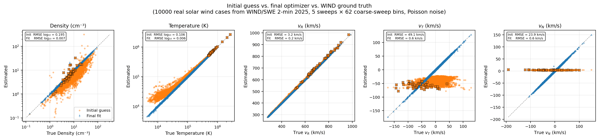

# SWAPI Solar Wind Moments Algorithm Notes

## Input Data

### L2 Science Data

The primary input for `SwapiProcessor` is SWAPI L2 coincidence count-rate data (`imap_swapi_l2_sci`). Each CDF contains time-ordered ESA sweeps with fields:

- `swp_coin_rate` — coincidence count rate (Hz) for each ESA step.
- `esa_energy` — energy-per-charge setting for each ESA step. It is related to the actual ESA voltage setting of the instrument by $V = -\texttt{esa\_energy} / k_\text{L2}$, where $k_\text{L2} = 1.93$ eV/V/e.
- `sci_start_time` — sweep start epoch (TT2000 ns)

#### ESA steps

Each 12-second ESA sweep contains **72 ESA steps** (indices 0–71). Their roles are:

| Indices | Count | Description |
|---------|-------|-------------|
| 0       | 1     | **Always discarded.** Voltage ramp-up step. |
| 1–62    | 62    | **Coarse steps.** Fixed ESA voltage steps with logarithmic spacing. |
| 63–71   | 9     | **Fine steps.** Depends on instrument mode, but usually provides a higher-resolution scan of the proton peak, using smaller voltage steps. |

To fit protons, we use both the coarse steps and the fine steps, since the fine steps usually provide extra information about the protons.
To fit alphas, we use only the coarse steps.

Occasionally, one or more fine steps will have zero ESA voltage; these are excluded from the fit.
Likewise, only steps near the proton peak are included.

For both protons and alphas, most of the steps are discarded and only the few that are near the peak are actually used.

#### Cadence

The CDF provides these 12-second sweeps for one day per file.
 `SwapiProcessor` groups sweeps into non-overlapping 5-sweep chunks (60s cadence), the least common multiple of the spin rate (approximately 15s) and the sweep cadence (12s).

The use of 5 sweeps makes it possible to determine the bulk velocity of the solar wind.
The solar wind fitting algorithms are applied to these 5-sweep chunks individually.

### SPICE Kernels

The processor requires RTN to SWAPI rotation matrices and IMAP's velocity in the Sun's reference frame from the SPICE kernels, used for transforming the solar wind proton bulk velocity. 

The start time for each sweep, available from the L2 CDF, is denoted $t_\text{epoch}$.
For ESA step $i$ (0-indexed, although recall that step 0 is skipped), the measurement time is:
$$t_i = t_\text{epoch} + i \cdot \tfrac{12}{72}\,\text{s} = t_\text{epoch} + i \cdot 0.1\overline{6}\,\text{s}.$$

### MAG RTN (alpha only)

The alpha moments depend on the local magnetic field direction because the alpha-proton drift is constrained to lie along the direction of the magnetic field ($\hat{\mathbf{B}}$).

#### L2 vs L1D
The dependency prefers MAG **L2** and falls back to **L1D** when no L2 file is available. MAG is required for `alpha-sw`; the processor raises `ValueError` if neither product is provided, matching SWE's dependency loader behavior.

When L1D is the source, every alpha-sw chunk in the run has its `PRELIMINARY_MAG` bit set so the product can be flagged for reprocessing once L2 is available. `proton-sw` and `pui-he` do not consume MAG.

#### Averaging scheme

For each 5-sweep alpha chunk, the processor uses the full $60\,\text{s}$ MAG window $[\,t_\text{center} - 30\,\text{s},\; t_\text{center} + 30\,\text{s})$.
The in-window RTN samples are averaged directly, and the mean vector is normalized to produce $\hat{\mathbf{B}}^\text{RTN}$.

#### Missing values

If $\hat{\mathbf{B}}^\text{RTN}$ cannot be computed (empty MAG window or fill values among the in-window samples), the chunk is flagged `MAG_GAP` and is assigned fill values.

## SWAPI Response Model

The coincidence count rate at ESA voltage $V$ is
$$C(V) = \sum_s \int d^3v \; v \, f^s(\mathbf{v}) \, \mathcal{A}^s(\mathbf{v}, V),$$
where $f^s$ is the VDF of species $s$ and $\mathcal{A}^s$ is the effective area.

#### Effective area decomposition

$\mathcal{A}^s$ is decomposed as
$$\mathcal{A}^s(v, \theta, \phi, V) = \mathcal{A}_0^s(V) \cdot P\!\left(\dfrac{v}{v_0^s},\, \theta,\, \phi,\, V\right) \cdot \mathcal{T}(\phi),$$
where:
- $v_0^s = \sqrt{2 k^* q^s |V| / m^s}$ is the central speed;
- $\mathcal{A}_0^s$ is the central effective area;
- $P$ is the energy-angle passband;
- $\mathcal{T}$ is the azimuthal transmission factor.

Copies of these three functions in the form of CSV files are in `instrument_team_data/swapi`.

#### Normalization point

The normalization of $\mathcal{A}_0^s$ and $P$ are aligned in terms of the value at $\theta = 0$ and $k^* \equiv 1.89$ eV/V/e, the peak $E/|V|$ at $\theta=0^\circ$ based on high-resolution SIMION simulations.

$k*s$ differs from $k_\text{L2} = 1.93 eV/V/e$, which is the $k$-factor estimated pre-launch from lab measurements (Rankin et al. 2025).
They differ primarily due to slight inaccuracy of the beam energy and orientation in the lab measurements. 

#### Tabulated form and grid construction

`SwapiResponse` holds the in-memory representation of the three components of the response function: $\mathcal{T}(\phi)$, $\mathcal{A}_0^s(V)$, and the passband fit coefficients for $P$.

$\mathcal{T}(\phi)$ and $\mathcal{A}_0^s(V)$ are 1D functions stored in simple CSV files. $\mathcal{T}$ is sampled at 0.1° spacing in $|\phi|$; $\mathcal{A}_0^s$ is sampled on the CSV's voltage grid.
Both are interpolated linearly between samples.
$\mathcal{A}_0^s$ is clamped to its endpoints outside the tabulated voltage range.

> 
> *Central effective area and azimuthal transmission.* [[src]](figure_src/plot_calibration_curves.py)

$P$ for a given $V$ is represented as a `PassbandGrid` object.
The CSV file contains quadratic polynomial fits of $\log P$ for each ($\theta$, $v/v_0$) pixel as a function of $\log(k^* |V|)$. Open aperture ($|\phi| > 20°$) and sunglasses ($|\phi| \leq 20°$) have separate fits.

`SwapiResponse.create_passband_grid` evaluates those fits at the requested $V$ and resamples the speed-ratio axis onto a uniform grid: $\theta$ matches the CSV elevations ($-15°$ to $15°$ in $0.5°$ steps) and $v/v_0$ is resampled to $0.9$ to $1.1$ in 101 points. The resulting per-region grids are held on `PassbandGrid` as `values_open_aperture` and `values_sunglasses`, used for bilinear interpolation in $(\theta, v/v_0)$ inside the integrator. Voltages outside the fitted range are clamped to the nearest endpoint.

> *Example passbands.* [[src]](figure_src/plot_passband_boundaries.py)

`PassbandGrid` also stores the passband region used by the integrator: a per-region elevation range (`oa_elevation_range`, `sg_elevation_range`) bounding the $\theta$ integration window, and per-elevation speed-ratio bounds (`min_OA_boundary`, `max_OA_boundary`, `min_SG_boundary`, `max_SG_boundary`) bounding the $v$ integration window for each elevation row inside that range.

The region is set by a threshold of 1% of that region's grid maximum (computed independently for SG and OA). For each elevation row with at least one above-threshold cell, the speed-ratio bounds are the first speed-ratio pixels just outside the above-threshold region. Rows with no above-threshold cell are omitted.

The elevation range is anchored at the interpolated crossing where the row maximum drops below threshold. Both the speed-ratio bounds and elevation range are recomputed for every $V$, since the polynomial fits change shape with voltage.

When an integration elevation falls between stored passband-bound rows, the wider neighboring interval is used. This avoids clipping the passband between rows.

`SwapiProcessor` precomputes a `PassbandGrid` for each unique ESA voltage in an L2 file once, before fitting any of the 5-sweep chunks.
At fit setup, each ESA voltage step is wrapped in a `ResponseGrid` that bundles the precomputed passband grid with the species-dependent central speed $v_0$, central effective area, and azimuthal transmission.

## Forward Model

#### Velocity Distribution Function

The solar wind proton velocity distribution function (VDF) is modeled as a drifting Maxwellian. In instrument coordinates, it is parameterized by bulk velocity ($v_b, \theta_b, \phi_b$), proton temperature $T_p$ in Kelvin, and density $n$.
The VDF is given by:
$$f_p(\mathbf{v}) = f_p(v, \theta, \phi) = \frac{n}{(\sqrt{2\pi}\, v_\text{th})^3} \exp\!\left(-\frac{v^2 + v_b^2 - 2 v\, v_b \cos\alpha(\theta, \phi)}{2 v_\text{th}^2}\right),$$
where $\theta$ is elevation, $\phi$ is azimuth, $\cos\alpha = \sin\theta_b \sin\theta + \cos\theta_b \cos\theta \cos(\phi - \phi_b)$, and $v_\text{th} = \sqrt{k_B T_p/m_p}$.

#### Coincidence Rate Integral

Substituting the VDF into the count rate integral in spherical velocity coordinates $(v, \theta, \phi)$:
$$C(V) = \frac{n\, \mathcal{A}_0(V)}{(\sqrt{2\pi}\, v_\text{th})^3} \sum_\text{region} \int \cos\theta\, d\theta \int \mathcal{T}(\phi)\, d\phi \int v^3\, P\!\left(\tfrac{v}{v_0}, \theta\right) \exp\!\left(-\frac{v^2 + v_b^2 - 2vv_b\cos\alpha}{2v_\text{th}^2}\right) dv.$$
The $v^3\cos\theta$ factor comes from the velocity-space volume element $v^2\cos\theta\,dv\,d\theta\,d\phi$ times the particle speed $v$ in the flux term.

#### Azimuthal Regions

The "region" sum runs over five azimuth regions: sunglasses (SG, $|\phi| \leq 20°$), and the open aperture split into a vanes-vignetting (VV) sub-region adjacent to each vane ($20° \leq |\phi| \leq 26°$) and the primary open aperture region (OA) away from the influence of the sunglasses ($26° \leq |\phi| \leq 150°$).

Splitting the open aperture at $\pm 26°$ anchors a boundary at the inflection of $\mathcal{T}(\phi)$, which is identically zero at $|\phi| = 20°$ (vanes fully blocking) and rises to $\sim 1$ by $|\phi| \approx 30°$ with a sharply increasing slope.
The sharp change in slope is because the sunglasses grid itself introduces a vignetting effect that extends about as far as the vanes' vignetting.

Another advantage of splitting the azimuthal integration is that only one passband needs to be used for each region.

### Angular limits

For each azimuth region, the angular cutoff $\Delta\alpha$ is chosen from the VDF angular falloff at the passband central speed $v_0$. At fixed speed $v$, the Maxwellian's angular dependence relative to its on-axis value is
$$\frac{f(v, \alpha)}{f(v, 0)} = \exp\!\left(\frac{v v_b (\cos\alpha - 1)}{v_\text{th}^2}\right).$$
Setting this ratio to $\varepsilon$ at $v = v_0$ and solving for $\alpha$:
$$\Delta\alpha = \frac{180}{\pi}\arccos\!\left(\mathrm{clamp}\!\left(\frac{v_\text{th}^2 \ln\varepsilon}{v_0 v_b} + 1;\; -1,\; 1\right)\right),$$
with $\varepsilon_\text{SG} = \varepsilon_\text{OA} = 10^{-6}$. If the VDF is broad enough that the arccos argument would leave $[-1, 1]$, the clamp makes $\Delta\alpha = 180^\circ$.

The implementation uses this angular cutoff as a rectangular half-extent in elevation and azimuth:
$$[\theta_b - \Delta\alpha,\; \theta_b + \Delta\alpha] \times [\phi_b - \Delta\alpha,\; \phi_b + \Delta\alpha].$$
This rectangle is conservative: it contains the angular disk of radius $\Delta\alpha$ around the bulk direction.

The window is then clamped to the passband elevation range for the region and to that region's azimuth span:

| Region | Azimuth Range |
|--------|----------------|
| SG     | $[-20°,\; 20°]$ |
| VV−    | $[-26°,\; -20°]$ |
| VV+    | $[20°,\; 26°]$ |
| OA−    | $[-150°,\; -26°]$ |
| OA+    | $[26°,\; 150°]$ |

If either clamped dimension has zero width, that region is skipped.

For OA± only, the azimuth window is trimmed once more using the product of the VDF and azimuthal transmission. `_trim_oa_azimuth_by_integrand` samples 64 points of $f(v_0, \theta_b', \phi)\mathcal{T}(\phi)$ across the clamped OA azimuth window, where $\theta_b'$ is $\theta_b$ clamped into the OA elevation range. It keeps the portion above $10^{-6}$ of its maximum and expands by one sample on each side.

After this trim, OA$\pm$ is skipped when the heuristic upper estimate
$$\hat{C}_\text{OA} = \mathcal{A}_0(V)\,v_0^3\,\Delta\theta\,\Delta v\,\int_{\phi_\text{lo}}^{\phi_\text{hi}} \mathcal{T}(\phi)\,g(\phi)\,d\phi$$
falls below $\max(0.1\;\text{Hz},\; 10^{-3} C_\text{SG})$. Here $g(\phi) = f(v_0, \theta_b', \phi)$, $\Delta\theta$ is the clamped OA elevation width in radians, and $\Delta v = (r_\text{max}(0) - r_\text{min}(0))v_0$ is the OA passband speed width at $\theta = 0^\circ$.

### Speed limits

For each Gauss-Legendre elevation node, the speed integral only needs to cover speeds where both of these are true:

1. The VDF is non-negligible.
2. The SWAPI passband is nonzero at that elevation.

The VDF speed interval is taken to be
$$[v_b - \Delta v_\text{VDF},\; v_b + \Delta v_\text{VDF}], \qquad \Delta v_\text{VDF} = 6v_\text{th},$$
where $v_b = |\mathbf{v}_b|$ and $v_\text{th}$ is the thermal speed. For the Maxwellian VDF used here, this captures essentially all of the distribution: at $6\sigma$ the radial factor is $e^{-18} \approx 10^{-8}$ of peak. A much wider window (e.g., $10v_\text{th}$) makes Gauss-Legendre concentrate nodes far from the integrand peak for cold plasma where the passband already extends well beyond $6v_\text{th}$; a much narrower one (e.g., $3v_\text{th}$) clips the Maxwellian wings too much for off-peak passband alignments.

The passband speed range is stored as speed-ratio bounds relative to the central passband speed $v_0$:
$$[r_\text{min}(\theta)v_0,\; r_\text{max}(\theta)v_0].$$
Here $r_\text{min}(\theta)$ and $r_\text{max}(\theta)$ depend on both elevation and aperture region (SG or OA). They describe where the passband at that elevation remains above the integration cutoff.

The speed integration limits are the intersection of those two windows:
$$v_\text{lo}(\theta) = \max\!\left(v_b - \Delta v_\text{VDF},\; r_\text{min}(\theta)v_0\right),$$
$$v_\text{hi}(\theta) = \min\!\left(v_b + \Delta v_\text{VDF},\; r_\text{max}(\theta)v_0\right).$$

#### Quadrature behavior

`calculate_integral` evaluates each region as nested Gauss-Legendre quadratures with a fixed number of integration points:
$$(N_\theta, N_\phi, N_v) = (21,\;21,\;15).$$

The nested integration loop order is $\theta$ → $\phi$ → $v$
The code implementation computes terms in the outermost loop where they are constant as much as possible and attempts to maximize CPU cache usage efficiency.

### Integrator Validation

The optimized integrator (`calculate_integral`) is validated against a high-resolution fixed-limit reference integrator (`reference_integral_fixed_limits`) — the same forward model evaluated on a much denser fixed grid with no dynamic integration limits.

The figure below compares the two integrators on six solar wind configurations: cold and hot temperatures, bulk elevation past the SG passband edge, bulk azimuth straddling the SG/OA boundary, and high speed.

*Generated by `docs/swapi/figure_src/plot_spectra.py`.*

For aggregate accuracy, the optimized integrator is evaluated against the same reference integral over 10000 random solar-wind configurations (`reference_integrals.csv`).
Each configuration is evaluated at the ESA voltage whose central proton speed equals its `bulk_speed`. 
The table below summarizes the distribution of $|\text{ratio} - 1|$ grouped by reference coincidence rate.

<!-- BEGIN: validation_table (auto-generated by docs/swapi/figure_src/build_validation_table.py — do not edit by hand) -->
| Reference (Hz)  |     N |  Median |     95% |     99% |     Max |
|-----------------|-------|---------|---------|---------|---------|
| $< 0.1$         |  2132 | 100.00% | 100.00% | 100.00% | 100.00% |
| $0.1$ – $1$     |   235 |   5.32% |  24.60% |  36.49% |  42.88% |
| $1$ – $10$      |   325 |   2.12% |  13.17% |  20.68% |  28.64% |
| $10$ – $10^2$   |   383 |   0.98% |   7.67% |  13.32% |  16.02% |
| $10^2$ – $10^3$ |   525 |   0.55% |   3.69% |   9.31% |  13.96% |
| $10^3$ – $10^4$ |   865 |   0.30% |   1.66% |   5.02% |  11.10% |
| $10^4$ – $10^5$ |  1694 |   0.15% |   0.70% |   1.40% |   2.97% |
| $\geq 10^5$     |  3841 |   0.09% |   0.35% |   0.60% |   1.52% |
<!-- END: validation_table -->
*Generated by `docs/swapi/figure_src/build_validation_table.py`.*

For high-rate cases ($\geq 10^3$ Hz) where proton fit residuals are dominated by Poisson noise rather than integrator error, $|\text{ratio} - 1|$ stays within a few percent of unity at the 99th percentile. The $< 0.1$ Hz band is configurations where the bulk direction sits many sigma outside the FOV — both integrators round to well below SWAPI's noise floor (which varies between 0.1 Hz and 10 Hz, typically closer to 10 Hz), so the ratio is clamped to $100\%$.
The worst cases at typical solar wind coincidence rate ($\geq 10^4$ Hz) are primarily due to bulk flow directions near the edge of the instrument response, which is rare by design because of the alignment of SWAPI's boresight and the spacecraft spin axis with the nominal average solar wind direction.

## Analytic Jacobian

The Levenberg–Marquardt step needs the residual Jacobian $\partial r_i/\partial p_j = \partial C_i^\text{model}/\partial p_j$ for each parameter $p_j$. Because $C = \int d^3v\,v\,f\,\mathcal{A}$ is linear in $f$ and the response $\mathcal{A}$ does not depend on the Maxwellian parameters, the parameter Jacobian of $C$ inherits the pointwise Jacobian of $f$:
$$\frac{\partial C(V)}{\partial p_j} = \int d^3v\,v\,\frac{\partial f}{\partial p_j}(\mathbf{v})\,\mathcal{A}(\mathbf{v}, V).$$
The same quadrature used for $C$ then delivers all five Jacobian columns in one pass at the cost of an extra integrand vector. The rest of this section derives $\partial f/\partial p$ for the optimizer's parameter vector $p = (\ln n,\, \ln T,\, v_R,\, v_T,\, v_N)$ — density and temperature in log-space, velocity in linear RTN components.

Reuse the spherical-coordinate Maxwellian from [Velocity Distribution Function](#velocity-distribution-function),
$$f(v, \theta, \phi) = \frac{n}{(2\pi)^{3/2}\,v_\text{th}^3}\,\exp\!\left(-\frac{v^2 + v_b^2 - 2\,v\,v_b\cos\alpha}{2\,v_\text{th}^2}\right),$$
with $\cos\alpha(\theta, \phi) = \sin\theta_b\sin\theta + \cos\theta_b\cos\theta\cos(\phi - \phi_b)$, $v_\text{th}^2 = k_B T/m$, and $(v_b, \theta_b, \phi_b)$ the magnitude/elevation/azimuth of the instrument-frame bulk velocity $\mathbf{v}_b^\text{XYZ} = R\,\mathbf{v}_b^\text{RTN}$ where $\mathbf{v}_b^\text{RTN} = (v_R, v_T, v_N)^\top$. Taking the log,
$$\ln f = \ln n - \tfrac{3}{2}\ln v_\text{th}^2 - \frac{v^2 + v_b^2 - 2\,v\,v_b\cos\alpha}{2\,v_\text{th}^2} + \text{const}.$$

### Density

$f$ is linear in $n$, so
$$\frac{\partial f}{\partial n} = \frac{f}{n}.$$

Converting to log-space via $\partial f/\partial \ln n = n\,\partial f/\partial n$,
$$\frac{\partial f}{\partial \ln n} = f.$$

### Temperature

$T$ enters $f$ only through $v_\text{th}^2 = k_B T/m$, so it is cleaner to first differentiate wrt $v_\text{th}^2$ and then convert. Reading off $\ln f$,
$$\frac{\partial \ln f}{\partial v_\text{th}^2} = -\frac{3}{2\,v_\text{th}^2} + \frac{v^2 + v_b^2 - 2\,v\,v_b\cos\alpha}{2\,v_\text{th}^4}.$$
The first term comes from the $-\tfrac{3}{2}\ln v_\text{th}^2$ coefficient; the second from differentiating the exponent's $1/v_\text{th}^2$.

The remaining steps are three applications of the same change-of-variables identity,
$$\frac{\partial g}{\partial y} = \frac{\partial g}{\partial x}\cdot\frac{\partial x}{\partial y},$$
walking $v_\text{th}^2 \to T$, then $\ln f \to f$, then $T \to \ln T$.

First:
$$\frac{\partial \ln f}{\partial T} 
= 
  \frac{\partial v_\text{th}^2}{\partial T} 
  \cdot 
  \frac{\partial \ln f}{\partial v_\text{th}^2}
= \frac{v_\text{th}^2}{T}\,\frac{\partial \ln f}{\partial v_\text{th}^2} = \frac{1}{T} \cdot \left(\frac{v^2 + v_b^2 - 2\,v\,v_b\cos\alpha}{2\,v_\text{th}^2} - \tfrac{3}{2}\right).$$

Then:
$$
\frac{\partial f}{\partial T}
  = \frac{f}{T}\cdot\left(\frac{v^2 + v_b^2 - 2\,v\,v_b\cos\alpha}{2\,v_\text{th}^2} - \tfrac{3}{2}\right).
$$

Finally:
$$
  \frac{\partial f}{\partial \ln T}
    = f\cdot\left(\frac{v^2 + v_b^2 - 2\,v\,v_b\cos\alpha}{2\,v_\text{th}^2} - \tfrac{3}{2}\right).
  $$

The sign reverses across $v^2 + v_b^2 - 2\,v\,v_b\cos\alpha = 3\,v_\text{th}^2$: increasing $T$ decreases $f$ for $v \approx v_b$ and increases it for $v \gg v_b$.

### Bulk velocity components

The squared offset in the exponent is the magnitude of a vector difference,
$$v^2 + v_b^2 - 2\,v\,v_b\cos\alpha = |\mathbf{v} - \mathbf{v}_b^\text{XYZ}|^2,$$
where both $\mathbf{v}$ (the integration variable) and $\mathbf{v}_b^\text{XYZ}$ (the bulk velocity in instrument coordinates) are 3-vectors in the instrument-frame XYZ. Let $R$ be the rotation matrix from RTN to instrument XYZ, so that the spacecraft-frame (RTN) bulk velocity $\mathbf{v}_b^\text{RTN} = (v_R, v_T, v_N)^\top$ maps to its instrument-frame representation as $\mathbf{v}_b^\text{XYZ} = R\,\mathbf{v}_b^\text{RTN}$. Substituting that into the squared offset and expanding using $R^\top R = I$ (so $|R\,\mathbf{v}_b^\text{RTN}|^2 = |\mathbf{v}_b^\text{RTN}|^2$):
$$\tfrac{1}{2}|\mathbf{v} - R\,\mathbf{v}_b^\text{RTN}|^2 = \tfrac{1}{2}|\mathbf{v}|^2 \;-\; \mathbf{v}^\top R\,\mathbf{v}_b^\text{RTN} \;+\; \tfrac{1}{2}|\mathbf{v}_b^\text{RTN}|^2.$$

The first term is independent of $\mathbf{v}_b^\text{RTN}$. Differentiating the other two,
$$\nabla_{\mathbf{v}_b^\text{RTN}}\!\bigl[-\mathbf{v}^\top R\,\mathbf{v}_b^\text{RTN}\bigr] = -R^\top\mathbf{v}, \qquad \nabla_{\mathbf{v}_b^\text{RTN}}\!\bigl[\tfrac{1}{2}|\mathbf{v}_b^\text{RTN}|^2\bigr] = \mathbf{v}_b^\text{RTN}.$$

Adding, and using $\mathbf{v}_b^\text{RTN} = R^\top R\,\mathbf{v}_b^\text{RTN} = R^\top\mathbf{v}_b^\text{XYZ}$ to factor out $R^\top$,
$$\nabla_{\mathbf{v}_b^\text{RTN}}\!\left[\tfrac{1}{2}\bigl(v^2 + v_b^2 - 2\,v\,v_b\cos\alpha\bigr)\right] = -R^\top\mathbf{v} + R^\top\mathbf{v}_b^\text{XYZ} = -R^\top\bigl(\mathbf{v} - \mathbf{v}_b^\text{XYZ}\bigr).$$

Now propagate this through $f$. Since $\mathbf{v}_b^\text{RTN}$ enters $f$ only via the squared offset in the exponent, $\ln f$ depends on $\mathbf{v}_b^\text{RTN}$ only through the single term $-\tfrac{1}{2}|\mathbf{v} - \mathbf{v}_b^\text{XYZ}|^2/v_\text{th}^2$. The constant $-1/v_\text{th}^2$ pulls out of the gradient,
$$\nabla_{\mathbf{v}_b^\text{RTN}}\ln f = -\frac{1}{v_\text{th}^2}\,\nabla_{\mathbf{v}_b^\text{RTN}}\!\left[\tfrac{1}{2}|\mathbf{v} - \mathbf{v}_b^\text{XYZ}|^2\right].$$
Substituting the gradient computed above:
$$\nabla_{\mathbf{v}_b^\text{RTN}}\ln f = -\frac{1}{v_\text{th}^2}\cdot\bigl[-R^\top(\mathbf{v} - \mathbf{v}_b^\text{XYZ})\bigr] = \frac{1}{v_\text{th}^2}\,R^\top\!\bigl(\mathbf{v} - \mathbf{v}_b^\text{XYZ}\bigr).$$

Multiplying by $f$ (since $f\,\nabla\ln f = \nabla f$) and distributing $R^\top$ across the offset (so $\mathbf{v}_b^\text{XYZ}$ never has to be materialized),
$$\nabla_{\mathbf{v}_b^\text{RTN}} f = \frac{f}{v_\text{th}^2}\,\bigl(R^\top\mathbf{v} - \mathbf{v}_b^\text{RTN}\bigr).$$
The three components are
$$\frac{\partial f}{\partial v_R} = \frac{f}{v_\text{th}^2}\,\bigl(R^\top\mathbf{v} - \mathbf{v}_b^\text{RTN}\bigr)_R, \qquad \frac{\partial f}{\partial v_T} = \frac{f}{v_\text{th}^2}\,\bigl(R^\top\mathbf{v} - \mathbf{v}_b^\text{RTN}\bigr)_T, \qquad \frac{\partial f}{\partial v_N} = \frac{f}{v_\text{th}^2}\,\bigl(R^\top\mathbf{v} - \mathbf{v}_b^\text{RTN}\bigr)_N.$$
At each integration node, $\mathbf{v}$ is built in instrument XYZ from $(v, \theta, \phi)$ via the precomputed trigonometric terms.

### Boundary terms

The integration limits $r_\text{min}(\theta),\,r_\text{max}(\theta),\,\theta_\text{lo},\,\theta_\text{hi}$ are themselves functions of $(v_b, v_\text{th})$ via [Angular limits](#angular-limits) and [Speed limits](#speed-limits). For an analytic Jacobian we hold the limits fixed at the current estimate and drop the Leibniz boundary terms. This is exact at the soft VDF cutoffs ($6\,v_\text{th}$ in speed, $\varepsilon = 10^{-6}$ in angle), where the dropped contribution is suppressed by the same $\sim 10^{-6}$–$10^{-8}$ factor that motivated the cutoff. It is an approximation at the passband boundary; in practice that boundary contributes little because the passband itself smoothly shapes the integrand.

## Fitting Procedure

Given $N$ measurements $(C_i, V_i, t_i)$, the solar wind moments $(n, T, \mathbf{v}_b^\text{SC})$ are fit in three steps:
1. Obtain RTN $\rightarrow$ SWAPI rotation matrices $R_i$ from SPICE.
2. Compute an initial guess: bulk speed and temperature from a Gaussian curve fit on the per-bin count rate, bulk velocity direction anti-parallel to the mean RTN spin axis, density from forward-model scaling.
3. Refine by nonlinear least squares, with a spin-axis-flip wrong-basin escape after LM.

The alpha particle moments are fit in a separate two-stage procedure described in [Alpha Particle Moments](#alpha-particle-moments).

### Step 1: SPICE

$R_i$ (shape $N \times 3 \times 3$) are precomputed for each measurement time (see [SPICE Kernels](#spice-kernels)).

### Step 2: Initial guess

**Bulk speed and temperature** are seeded from the peak ESA bin and a closed-form $T(v)$ scaling, then refined by a Gaussian curve fit on the per-bin count rate. The peak-bin seed is
$$v_b^{(0)} = v_{i^*}, \qquad i^* = \arg\max_i C_i, \qquad T_0 = \max\!\left(60{,}000\,\text{K} \cdot \left(\frac{v_b^{(0)}}{400\;\text{km/s}}\right)^2,\; T_\text{floor}\right),$$
with $T_\text{floor} \approx 11{,}600$ K. Multiple sweeps over the same voltage produce repeated samples that `scipy.optimize.curve_fit` treats independently. The fit yields a refined $(v_b, \sigma_v)$, and the temperature seed becomes $T_0 = m\,(\sigma_v\cdot 10^3)^2 / k_B$ (floored at $T_\text{floor}$). On `curve_fit` failure or non-positive $\sigma_v$, the seed values are kept.

**Velocity direction** is anti-parallel to the mean RTN spin axis (extracted by averaging $R_i[1, :]$ — the second row of each RTN→SWAPI matrix — and renormalizing):
$$\mathbf{v}_b^\text{SC,(0)} = -v_b\,\hat{\mathbf{s}}^\text{RTN}.$$
This is the natural seed for solar wind, which flows nearly along the spin axis in RTN, and avoids hardcoding any frame velocity. The optimizer in Step 3 recovers the small transverse components from the spin-phase modulation of the bulk azimuth/elevation in the instrument frame.

**Density** is set by least-squares scaling of a unit-density forward model against the observed count rates:
$$n_0 = \frac{\mathbf{m} \cdot \mathbf{C}}{\mathbf{m} \cdot \mathbf{m}}, \qquad \mathbf{m}_i = C_i^\text{model}(n = 1; T_0, \mathbf{v}_b^\text{SC,(0)}).$$
This is exact for the linear $n$-dependence of the model and is robust to residual direction and temperature errors: the LM optimizer absorbs them in Step 3.

Figure below shows initial-guess and final-fit accuracy across 10000 real solar wind cases sampled from WIND/SWE 2-min 2025 (high-quality bimaxwellian fits, fit_flag = 10), with the WIND-derived $(n, T, v_R, v_T, v_N)$ used as ground truth via a GSE→RTN approximation valid at L1. Synthetic count rates are produced from the forward model using the real SWAPI 71-step science voltage sweep (from the L2 CDF), 5 sweeps per fit, realistic spin geometry (spin axis = boresight, 15 s period), and Poisson noise — matching the production processor exactly. The wrong-basin escape in Step 3 ensures the optimizer reaches the truth basin regardless of the initial transverse velocity. Generated by `docs/swapi/figure_src/plot_fit_accuracy.py`.

### Step 3: Optimization

Parameters $[\log n,\, \log T,\, v_R,\, v_T,\, v_N]$ (with $\mathbf{v}_b^\text{SC} = (v_R, v_T, v_N)$ in the spacecraft RTN frame) are fit by `scipy.optimize.least_squares` using the Levenberg–Marquardt algorithm (`method='lm'`, `diff_step=1e-4`, `xtol=1e-4`) with unweighted residuals over all bins:
$$r_i = C_i^\text{model} - C_i.$$
Density and temperature are parameterized in log-space to keep them positive throughout optimization. The optimizer's `success` flag is mapped to `bad_fit_flag`: failure sets `BAD_FIT`.

#### Wrong-basin detection (iterative spin-axis flip)

The proton fit has two nearby basins related by a mirror across the spin axis: roughly $(v_T, v_N) \rightarrow (-v_T, -v_N)$. The symmetry is not exact, because the sunglasses (SG) passband has a slightly asymmetric elevation range ($[-10.5^\circ, +7^\circ]$). In synthetic tests, the physical solution is the global minimum, while the mirror solution is only a local minimum and usually has $\chi^2$ about $100$ to $500\times$ larger.

LM is local, so the first solve can still converge to a wrong basin and stay there. After LM, the bulk velocity is reflected about the spin axis $\hat{\mathbf{s}}^\text{RTN}$ (averaged over the chunk's $R_i[1, :]$ and renormalized):
$$\mathbf{v}_b^\text{flip} = 2\,\hat{\mathbf{s}}\,(\hat{\mathbf{s}}\cdot\mathbf{v}_b) - \mathbf{v}_b.$$
A single forward-model evaluation at the flipped velocity is paired with a closed-form analytic density rescale
$$\alpha = \frac{\mathbf{m}\cdot\mathbf{C}}{\mathbf{m}\cdot\mathbf{m}}, \qquad \text{MSE}_\text{flip} = \|\alpha\mathbf{m} - \mathbf{C}\|^2 / N,$$
and an LM restart from the flipped seed runs only when $\text{MSE}_\text{flip} < 100\,\text{MSE}_\text{cur}$ (i.e. RMSE ratio $< 10$). Otherwise the current best is already deep enough in the truth basin that any flipped seed cannot reach a better minimum, and the loop terminates.

If the restart improves MSE strictly, it becomes the new "current" and the procedure repeats; otherwise the loop terminates. The maximum number of iterations is capped at 6, but in practice convergence happens in 1–2 iterations — once the loop reaches the opposite mirror basin, the next flip's MSE no longer beats it.

*Generated by `docs/swapi/figure_src/plot_wrong_basin.py`. In this example, the mirror minimum has $\chi^2$ roughly $200\times$ the true minimum. The flipped seed reaches the opposite basin with one LM solve.*

> **Note on `diff_step`.** The default finite-difference step in `least_squares` scales with the parameter magnitude, producing steps of $\sim 10^{-8}\ \text{km/s}$ for $v_T,\, v_N$ near zero. For cold plasma ($T \lesssim 60{,}000\ \text{K}$), the resulting count-rate perturbation falls below the GL-quadrature noise floor, making the numerical Jacobian for $v_T$ and $v_N$ pure noise and inflating the LM damping factor to $\sim 10^{13}$, which freezes all parameters. `diff_step=1e-4` is the empirical optimum over $\{10^{-5}, 10^{-4}, 10^{-3}, 10^{-2}, 10^{-1}\}$: it sits above the noise floor (giving a clean Jacobian and correct convergence) while keeping the linearization error small enough not to degrade accuracy ($10^{-2}$ degrades $v_N$ RMSE; $10^{-1}$ produces bad fits and a 5× slowdown).

Inside the model, the spacecraft-frame bulk velocity is rotated into instrument coordinates:
$$\mathbf{v}_{b,i}^\text{xyz} = R_i \, \mathbf{v}_b^\text{SC}.$$
The azimuth and elevation angles fed to the integral are then
$$\phi_{b,i} = \operatorname{arctan2}(-v_{b,i,x},\, -v_{b,i,y}), \qquad \theta_{b,i} = \arcsin\!\left(-\frac{v_{b,i,z}}{v_b}\right).$$
(Sign conventions and coordinate system follow the instrument paper.)

#### Deadtime correction

The detector deadtime is $\tau = 183.7\ \text{ns}$. Following Tsoulfanidis (1995), p. 74, the true count rate $n$ and measured rate $g$ are related by $n = g / (1 - g\tau)$. Rearranged for the forward model, the true model rate $C^\text{model}$ is mapped to the predicted observed rate before computing residuals:
$$C^\text{observed}_i = \frac{C^\text{model}_i}{1 + \tau\, C^\text{model}_i}.$$
This deadtime correction is often non-negligible.
It reaches 5% at $C \approx 2.7\times 10^5 \text{Hz}$, which is not an uncommonly high coincidence rate.
Not accounting for this would result in an overestimate of the model count rate and thus in underestimate of the density in such cases.

#### Parameter uncertainties

The optimizer returns the Jacobian $J$ of the residuals with respect to $[\log n,\, \log T,\, v_R,\, v_T,\, v_N]$ at the solution.
The parameter covariance related to the Jacobian (Vugrin et al., 2007).
We calculate it as:
$$\Sigma_x = s^2\,(J^\top J)^+, \qquad s^2 = \frac{\sum_i r_i^2}{N - p},$$
where ${}^+$ is the Moore–Penrose pseudoinverse $N$ is the number of measurements, and $p$ is the number of parameters (five). Residuals are unweighted, so the $s^2$ scaling absorbs both measurement noise and model imperfection (non-Maxwellian features, alpha contamination, intra-window variability) — equivalent to `scipy.optimize.curve_fit` with `absolute_sigma=False`. The directly fitted scalars get
$$\sigma_n = n\,\sqrt{\Sigma_{x,00}}, \qquad \sigma_T = T\,\sqrt{\Sigma_{x,11}}.$$

The fitted velocity $\mathbf{v}_b^\text{SC}$ (RTN) is built as a 3-tuple of correlated `uncertainties.UFloat` components carrying $\Sigma_v = \Sigma_x[2{:}5,\,2{:}5]$. `derive_velocity_angles` rotates this tuple into the IMAP DPS (despun spacecraft) frame so the angles describe plasma flow relative to the spacecraft attitude:
$$\mathbf{u} = R_\text{RTN\to DPS}\,\mathbf{v}_b^\text{SC}, \qquad |\mathbf{v}| = |\mathbf{u}|, \quad \phi_c = \arctan2(u_1,\, u_0) \bmod 360°, \quad \phi_d = \arccos\!\left(-u_2/|\mathbf{u}|\right).$$
The rotation is a linear map applied with `numpy` to the object-dtype UFloat array, so correlations propagate automatically; the DPS covariance is recovered with `uncertainties.covariance_matrix` and equals $R\,\Sigma_v\,R^\top$.

**Speed σ** is propagated through `umath.sqrt(sum(x**2 for x in u_unc))` — the `uncertainties` package's automatic delta method. The linearization is essentially exact whenever $|\mathbf{u}| \gg \sigma$, which is always true for SWAPI bulk speeds vs. fitted scatter, so MC would only add sampling noise.

**Clock and deflection angle σ** are propagated by Monte Carlo. The arctan2 and arccos gradients scale as $1/u_{xy}^2$ and $1/(|\mathbf{u}|^2\,u_{xy})$ and diverge as $u_{xy} \to 0$, where $u_{xy} = \sqrt{u_0^2 + u_1^2}$. SWAPI's bulk velocity is dominated by the spin-axis component, so $u_{xy} \sim \sigma_{xy}$ and the delta method underestimates σ by tens of percent in the typical regime (see `scripts/swapi/compare_angle_propagation.py`: cold spin-aligned plasma shows +49% bias on $\sigma_{\phi_c}$ and +46% on $\sigma_{\phi_d}$, with $\sigma_{\phi_c}$ exceeding the uniform-distribution bound of $\approx 104°$). Instead, we draw `N_VELOCITY_ANGLE_MC_SAMPLES = 1000` samples
$$\mathbf{u}_i \sim \mathcal{N}(\mathbf{u},\, \Sigma_\text{DPS}),$$
recompute $(\phi_c^{(i)}, \phi_d^{(i)})$ per sample, and take the sample standard deviation. Clock-angle σ uses residuals wrapped to $(-180°,\, 180°]$ relative to the nominal $\phi_c$ so the $0°/360°$ branch cut doesn't inflate the spread; deflection σ is the plain sample std (with the arccos argument clipped to $[-1,\,1]$ to absorb numerical overshoots from samples just outside the unit-direction shell). The RNG is seeded per call (`np.random.default_rng(0)`) so outputs are deterministic.

When $\Sigma_\text{DPS}$ is non-finite (failed fit), all three σ are NaN.

### Inertial bulk velocity and speed

The optimizer returns $\mathbf{v}_b^\text{SC}$ in the spacecraft RTN frame. To recover the plasma velocity in the sun's inertial rest frame the spacecraft velocity is added back:
$$\mathbf{v}_b^\text{sun} = \mathbf{v}_b^\text{SC} + \mathbf{v}_\text{sc}^\text{RTN},$$
where $\mathbf{v}_\text{sc}^\text{RTN}$ (km/s) is obtained at the chunk center epoch directly from `imap_state(et, IMAP_RTN)` — SPICE's underlying `sxform`-based 6D state transform produces the kinematic velocity in the dynamic RTN frame (i.e. it includes the rotation-rate term of the rotating frame), so no separate rotation step is applied.
This 3-vector is stored as `proton_sw_bulk_velocity_rtn_sun` (shape $N \times 3$, units km/s) in the proton L3A CDF. Its covariance is stored as `proton_sw_bulk_velocity_rtn_sun_covariance`. Since $\mathbf{v}_\text{sc}^\text{RTN}$ is SPICE-derived and treated as exact, the Sun-frame vector covariance is the fitted spacecraft-frame velocity covariance:
$$\Sigma_v^\text{sun} = \Sigma_v^\text{SC}.$$

The scalar CDF variable `proton_sw_speed` remains the magnitude of the fitted spacecraft-frame velocity. The separate scalar variable `proton_sw_speed_sun` is the magnitude of the Sun-frame vector:
$$v_\text{sun} = \left|\mathbf{v}_b^\text{SC} + \mathbf{v}_\text{sc}^\text{RTN}\right|.$$
Its uncertainty, `proton_sw_speed_sun_uncert`, is propagated with the `uncertainties` package from the correlated fitted velocity components in `result.bulk_velocity_rtn`, after adding the exact spacecraft-velocity offset:
$$\sigma_{v_\text{sun}} = \mathrm{std}\!\left(\sqrt{\sum_j \left(v_{b,j}^\text{SC} + v_{\text{sc},j}^\text{RTN}\right)^2}\right).$$
Equivalently, this is the first-order Gaussian propagation $\sqrt{\mathbf{g}_\text{sun}^\top \Sigma_v \mathbf{g}_\text{sun}}$ with $\mathbf{g}_\text{sun} = \mathbf{v}_b^\text{sun}/|\mathbf{v}_b^\text{sun}|$, but the implementation uses the correlated `UFloat` components directly rather than recomputing from `bulk_velocity_rtn_covariance()`.

## Alpha Particle Moments

The alpha solar wind moments fitter (`calculate_alpha_solar_wind_moments.py`) reuses the proton forward model (`model_solar_wind_ideal_coincidence_rates`) and adds a 3-DOF Levenberg–Marquardt fit over $(n_\alpha, T_\alpha, \Delta v)$ where alphas are constrained to drift along the local magnetic field:
$$\mathbf{v}_\alpha = \mathbf{v}_p^* + \Delta v \, \hat{\mathbf{B}}.$$
This encodes the observed solar-wind fact that non-field-aligned differential drift is quenched by firehose/mirror instabilities.

**Sign convention.** $\Delta v > 0$ means the alpha drifts along $+\hat{\mathbf{B}}$ relative to protons. Since MAG provides $\mathbf{B}$ with a physical polarity, $\Delta v$'s sign is interpretable.

### Two-stage strategy

The pipeline processes 5-sweep chunks (matching the existing alpha LUT cadence). Each chunk is sliced to the **62 coarse-sweep steps** (`SWAPI_COARSE_SWEEP_BINS`) and flattened over (sweep, step) to a 310-element axis. The 9 fine-sweep steps (63–71) are dropped because they cluster near the proton peak and inform proton thermal width only — useless when protons are held fixed.

- **Stage 1**: Re-run `fit_solar_wind_proton_moments` on the 310-element axis to get $(n_p^*, T_p^*, \mathbf{v}_p^{*\,\text{RTN}})$. This is independent of the per-sweep proton L3A product (which uses 71 steps) and is persisted as `reference_proton_*` fields in the alpha CDF.
- **Stage 2**: The initial guess (`_alpha_initial_guess`) identifies the alpha peak steps via `get_alpha_peak_indices`. All per-measurement arrays are then subset to only those peak steps across all sweeps, so the Levenberg–Marquardt fit targets the alpha bump rather than the proton-dominated tails (which create an $n_\alpha{\downarrow}/T_\alpha{\uparrow}$ degeneracy). The residual axis for Stage 2 is therefore `n_sweeps × len(peak_steps)`, not the full 310. The combined observed model is
  $$C_\text{obs}(V) = \text{deadtime}\!\left(C_p^\text{true}(V; \theta_p^*) + C_\alpha^\text{true}(V; \theta_\alpha)\right),$$
  so deadtime acts on the sum (important in proton-peak steps where alphas are negligible but deadtime is at its largest). Stage 2 reuses the SPICE rotation matrices computed for Stage 1.

Joint refit of both species is deferred (Stage 2 does not resolve alpha contamination of the proton fit).

### Species-dependent pieces

The same `PassbandGrid` infrastructure works for both species — the grid is V-only (passband shape depends only on voltage, not species), so `SWAPIResponse.create_passband_grid(V)` is cached by `float(V)` and shared between proton and alpha fits at the same ESA voltage. `SwapiProcessor` calls `SWAPIResponse.warm_cache(data.energy / SWAPI_L2_K_FACTOR)` in the parent process before forking the `multiprocessing.Pool`, so the pandas pivot inside `_build_passband_array` is paid once per unique voltage in the parent rather than once per worker; under `fork`, children inherit the populated cache and the bulk numpy buffers stay shared via copy-on-write. Species-dependent quantities — central speed $v_0^s$ and scaled central effective area — ride alongside the `PassbandGrid` inside the per-bin `ResponseGrid` consumed by `calculate_integral`. At the same $V$,
$$\frac{v_0^\alpha}{v_0^p} = \sqrt{\frac{q_\alpha m_p}{q_p m_\alpha}} = \sqrt{\frac{2 m_p}{4 m_p}} = \frac{1}{\sqrt 2}.$$
Thermal speed uses Boltzmann's constant with temperature in Kelvin:
$$v_{th}^\alpha = \sqrt{\frac{k_B T_\alpha}{m_\alpha}}.$$

### Effective-area scaling

`EfficiencyCalibrationTable` stores **absolute** detection efficiencies for each species ($\sim 0.11$ for protons, $\sim 0.15$ for alphas). The lab-calibrated `central_effective_area(V)` table is the proton ABM-derived $\mathcal{A}_0^p(V_\text{lab})$. At the integration site we apply a per-species ratio to convert this to the runtime species/time effective area:
$$\text{proton}: \quad \texttt{central\_effective\_area\_scale} = \frac{\varepsilon_p(t)}{\varepsilon_p(t_\text{lab})}$$
$$\text{alpha}: \quad \texttt{central\_effective\_area\_scale} = \frac{\varepsilon_\alpha(t)}{\varepsilon_p(t_\text{lab})}$$
The proton-lab denominator is used for **both** species so the alpha scale folds the species correction $\mathcal{A}_0^\alpha/\mathcal{A}_0^p \approx \varepsilon_\alpha/\varepsilon_p$ together with alpha time drift into a single ratio. This factor is exposed as `EfficiencyCalibrationTable.eps_p_lab`; until the cal-file format adds a `lab_time` field, it falls back to the earliest entry in the LUT.

When the LUT contains only the lab row, `proton_eff_scale = 1.0` exactly and proton outputs are unchanged from the pre-wiring code.

### Initial guess

Stage 2's initial guess (`_alpha_initial_guess`) locates the alpha bump by subtracting the deadtime-applied proton background from the sweep-averaged count rate:

1. Reshape data into `(n_sweeps, n_bins)` via `_infer_sweep_layout`. Average the 5 sweeps: `count_avg`, `proton_bg_avg` (deadtime-corrected proton model per sweep, then averaged).
2. Convert voltages to energies: $E_i = k^* |V_i|$ and form the residual $\rho_i = \max(0,\, \overline{C_i} - 2\,\overline{R_i^p})$. The factor of 2 hardens the alpha-bump finder against the deep proton thermal tail leaking into the low-energy alpha bins.
3. Call `get_alpha_peak_indices(residual, energies, proton_peak_index)` to return the alpha peak slice. The function walks from the proton peak toward higher energies (lower indices), past the gap where $E_i < 1.5\,E_\text{proton-peak}$, until it finds a residual local minimum that bounds the alpha bump on the proton side; the high-energy side is bounded at $E_i = 4\,E_\text{proton-peak}$.
4. Guard: require $\geq 3$ bins in the peak and at least one bin with positive residual.
5. Temperature seed: $T_\alpha = T_p^*$ (the proton temperature). The alpha thermal width is fit by LM in Stage 2 — there is no Gaussian pre-fit on the residual.
6. Density: compute a unit-density alpha forward model at $\Delta v = 0$ (using the proton bulk velocity as the alpha velocity seed), average across sweeps, and scale to match the mean residual at the peak:
   $$n_{\alpha,0} = \max\!\left(\frac{\overline{\rho_\text{peak}}}{\overline{R_\text{peak}^{\alpha,\text{unit}}}},\; 10^{-3}\right)$$
7. Return $(n_{\alpha,0}, T_\alpha, \Delta v = 0, \text{peak\_bin\_indices})$. The optimizer starts with $\Delta v = 0$ and the wrong-basin flip (below) handles sign ambiguity. The returned `peak_bin_indices` are used to subset the residual axis for Stage 2 (see above).

The figure below shows these steps on three real L2 spectra from `imap_swapi_l2_sci_20260101`. Top row: 5-sweep-averaged observed count rate (blue dots) vs the frozen proton model (orange), with the detected alpha peak region shaded green. Bottom row: residual (observed − proton model) at all bins (grey) and the peak bins (green circles).

*Generated by `docs/swapi/figure_src/plot_alpha_peak_finding.py`.*

### Wrong-basin detection ($\Delta v$ flip)

The 1-DOF $\Delta v$ parameterization creates a basin ambiguity along $\hat{\mathbf{B}}$: flipping $\Delta v \to -\Delta v$ can yield a comparable $\chi^2$ when the alpha bump sits near the proton thermal tail. After LM converges to $(\log n_\alpha, \log T_\alpha, \Delta v)$, the fit evaluates $\chi^2$ at the flipped point $(\log n_\alpha, \log T_\alpha, -\Delta v)$. If $\chi^2_{\text{flipped}} < \chi^2_{\text{LM}}$, LM re-runs from the flipped point. This costs one extra residual evaluation typically, plus one extra LM run for the cases that need it.

Unlike the proton wrong-basin check (which always re-runs LM from the flipped seed), the alpha flip uses a cheaper evaluate-then-rerun strategy because the 1-DOF flip preserves $(n_\alpha, T_\alpha)$ — unlike the proton case, where the 3-DOF velocity flip changes the $(n, T)$ landscape significantly enough that a single-point $\chi^2$ is a poor proxy.

### Uncertainty propagation

$$\Sigma_\text{stage 2} = s^2\,(J^\top J)^+\quad\text{(3×3, in $(\log n_\alpha, \log T_\alpha, \Delta v)$ space)}, \qquad s^2 = \frac{\sum_i r_i^2}{N - p}$$
$$\sigma_{n_\alpha} = n_\alpha \sqrt{\Sigma_\text{stage 2}[0,0]}, \qquad \sigma_{T_\alpha} = T_\alpha \sqrt{\Sigma_\text{stage 2}[1,1]}, \qquad \sigma_{\Delta v} = \sqrt{\Sigma_\text{stage 2}[2,2]}$$
$$\Sigma_{\mathbf{v}_\alpha} = \Sigma_{\mathbf{v}_p} + \sigma_{\Delta v}^2 \, \hat{\mathbf{B}}\hat{\mathbf{B}}^\top$$
This **ignores proton-parameter uncertainty's effect on Stage 2 residuals**, so $\sigma_{n_\alpha}, \sigma_{T_\alpha}$ are lower bounds.

### Quality flags (alpha-specific)

- `STALE_PROTON` (= 32): Stage 1 proton fit failed (proton `bad_fit_flag != NONE`). Stage 2 returns fill-valued moments without trying.
- `BAD_FIT` (= 8): fit was attempted with valid inputs but failed — reference proton velocity is nonphysical, peak-finding failed, or optimizer did not converge.
- `EPHEMERIS_GAP` (= 4): SPICE could not provide rotation matrices for the chunk's measurement times. The chunk is fill-valued without attempting a fit.
- `MAG_GAP` (= 128): SPICE geometry was available but MAG data is missing or contains fill values across the chunk window. The alpha fit is skipped and moments are fill-valued.
- `PRELIMINARY_MAG` (= 64): MAG L1D was used as the source for this run (L2 was unavailable). Set on every chunk in the run. The product is a candidate for reprocessing once MAG L2 covers the time range.

### Known limitations

- **Alpha species correction unproven**: $\mathcal{A}_0^\alpha(V_\text{lab}) / \mathcal{A}_0^p(V_\text{lab}) = \varepsilon_\alpha/\varepsilon_p$ is the natural-default extension because separate alpha ABM measurements weren't taken. Validate against OMNI alpha density.
- **Voltage-independent species efficiency ratio**: `EfficiencyCalibrationTable` stores scalar-per-species-per-time; the V-dependence of $\varepsilon_\alpha/\varepsilon_p$ is not modeled.
- **Frozen-proton uncertainty propagation**: alpha $n, T$ error bars from Stage 2 do not include proton-parameter uncertainty.
- **Alpha contamination of proton fit**: Stage 2 holds protons fixed, so their fit absorbs whatever bias the alpha bump caused in Stage 1. A future joint refit will address this.
- **Field-aligned-only drift**: transient non-field-aligned drifts (e.g. during CME shocks) will be fit as $\Delta v \approx 0$ plus elevated $\chi^2$.
- **Step-axis split**: Stage 1 inside the alpha processor uses 62 coarse steps, while the per-sweep proton L3A uses 71. Reference proton moments in the alpha product will differ slightly from the per-sweep L3A — compare per-chunk-mean of L3A vs `reference_proton_*` as a sanity diagnostic.

## References

- Rankin, J. S., McComas, D. J., et al. (2025). Solar Wind and Pickup Ion (SWAPI) Instrument on NASA's Interstellar Mapping and Acceleration Probe (IMAP). *Space Science Reviews*, 221(8), 108. https://doi.org/10.1007/s11214-025-01229-8 — SWAPI instrument paper; sign conventions and coordinate system (Step 3).
- Tsoulfanidis, N. (1995). *Measurement and Detection of Radiation* (2nd ed.). Taylor & Francis. p. 74. — Deadtime formula: $n = g / (1 - g\tau)$.
- Vugrin, K. W., et al. (2007). Confidence region estimation techniques for nonlinear regression in groundwater flow: Three case studies. *Water Resources Research*, 43, W03423. https://doi.org/10.1029/2005WR004804 — Parameter covariance $\Sigma_x = s^2 (J^\top J)^+$ with residual-scaled $s^2$.
