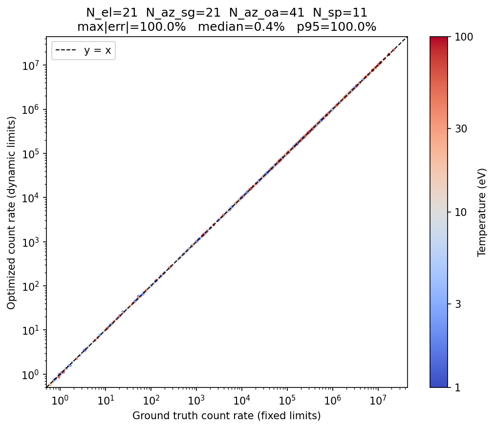

# SWAPI Solar Wind Moments Algorithm Notes

## Code Files

| File | Role |
|------|------|
| `imap_l3_processing/swapi/l3a/science/swapi_response.py` | Instrument response model. Loads calibration tables (azimuthal transmission, central effective area, passband polynomial fits) and builds a `PassbandGrid` per ESA voltage step via `SWAPIResponse.create_passband_grid`. |
| `imap_l3_processing/swapi/l3a/science/calculate_proton_solar_wind_moments.py` | Core fitting algorithm. `fit_solar_wind_proton_moments` implements the three-step procedure (SPICE → initial guess → Levenberg–Marquardt); `calculate_integral` is the Numba-JIT count-rate integral over elevation, azimuth, and speed. |
| `imap_l3_processing/swapi/l3a/science/speed_calculation.py` | ESA bin layout constants (`SWAPI_SCIENCE_BINS`, `SWAPI_COARSE_SWEEP_BINS`, `SWAPI_FINE_SWEEP_BINS`) and the `esa_voltage_to_proton_speed` conversion. |
| `imap_l3_processing/swapi/swapi_processor.py` | Production pipeline entry point. `SwapiProcessor.process_l3a_proton` slices science bins, computes per-bin measurement times, calls `fit_solar_wind_proton_moments`, and propagates uncertainties to scalar speed, clock angle, and deflection angle before writing the CDF. |
| `scripts/swapi/validate_proton_moments.py` | Offline validation script. Runs the fitter over a full day of real L2 data and produces a six-panel figure comparing fitted moments against OMNI reference data. |

## Model

The coincidence count rate at ESA voltage $V$ is
$$C(V) = \sum_s \int d^3v \; v \, f^s(\mathbf{v}) \, \mathcal{A}^s(\mathbf{v}, V),$$
where $f^s$ is the VDF of species $s$ and $\mathcal{A}^s$ is the effective area.

The effective area is decomposed as
$$\mathcal{A}^s(v, \theta, \phi, V) = \mathcal{A}_0^s(V) \cdot P^s\!\left(\dfrac{v}{v_0^s},\, \theta,\, \phi,\, V\right) \cdot T(\phi),$$
where $v_0^s = \sqrt{2 k^* q^s |V| / m^s}$ is the central speed ($k^* = 1.89$ eV/V), $\mathcal{A}_0^s(V)$ is the central effective area (from lab measurements, interpolated at each $V$), $P^s$ is the energy-angle passband (from SIMION, separate sunglasses/open-aperture grids, normalized to $P(1, 0°, V) = 1$), and $T(\phi)$ is the azimuthal transmission factor ($T \approx 10^{-3}$ at $|\phi| < 9°$).


*Generated by `docs/swapi/figure_src/plot_calibration_curves.py`.*

$P^s$ is voltage-dependent because the ESA's acceptance varies with beam energy. SIMION results at discrete energies are stored as polynomial fits in $\log(k^* |V|)$ and evaluated at runtime. For each $V_i$, `SWAPIResponse.create_passband_grid` evaluates these fits and resamples onto a uniform (elevation, speed-ratio) grid (`_TARGET_ELEVATIONS` = −12° to 10° in 1° steps, `_TARGET_SPEED_RATIOS` = 101 points from 0.9 to 1.1). The result is stored in a `PassbandGrid` struct, precomputed once per ESA step before optimization. The `min_*_boundary`/`max_*_boundary` arrays on `PassbandGrid` record the elevation-wise speed-ratio extents of the nonzero passband region (one grid step outside it). They are read inside the JIT integrator by `_eval_boundary` to set the per-elevation speed integration window — see [Speed limits](#speed-limits) below.

A **sine fit** on the coarse sweep data (peak energy vs. spin-phase) provides the initial bulk velocity direction; this is the preferred method and only falls back to the Gaussian described below if it fails.

The solar wind proton VDF is modeled as a drifting Maxwellian:
$$f_p(\mathbf{v}) = \frac{n}{(\sqrt{2\pi}\, v_\text{th})^3} \exp\!\left(-\frac{v^2 + v_b^2 - 2 v\, v_b \cos\alpha}{2 v_\text{th}^2}\right),$$
where $\cos\alpha = \sin\theta_b \sin\theta + \cos\theta_b \cos\theta \cos(\phi - \phi_b)$ and $v_\text{th} = \sqrt{T/m_p}$ ($T$ in energy units).

Substituting into the count rate integral in spherical velocity coordinates $(v, \theta, \phi)$:
$$C(V) = \frac{n\, \mathcal{A}_0(V)}{(\sqrt{2\pi}\, v_\text{th})^3} \sum_\text{region} \int \cos\theta\, d\theta \int T(\phi)\, d\phi \int v^3\, P\!\left(\tfrac{v}{v_0}, \theta\right) \exp\!\left(-\frac{v^2 + v_b^2 - 2vv_b\cos\alpha}{2v_\text{th}^2}\right) dv.$$

The sum runs over three azimuth regions: sunglasses (SG, $|\phi| \leq 20°$), left open aperture (OA, $-150° < \phi < -20°$), and right open aperture ($20° < \phi < 150°$).

### Angular limits

Integration limits are centered on $(\theta_b, \phi_b)$ and clamped per region to the bilinear-interpolation extent of that region's passband. The half-width is where the Maxwellian drops below $\varepsilon$:
$$\Delta\alpha = \arccos\!\left(\mathrm{clip}\!\left(\frac{v_\text{th}^2 \ln\varepsilon}{v_0 v_b} + 1;\; -1,\; 1\right)\right),$$
with $\varepsilon_\text{SG} = \varepsilon_\text{OA} = 10^{-6}$. The integration window is $[\theta_b - \Delta\alpha,\; \theta_b + \Delta\alpha]$ in elevation and $[\phi_b - \Delta\alpha,\; \phi_b + \Delta\alpha]$ in azimuth, then clamped per region:

| Region | Elevation bounds | Azimuth bounds |
|--------|------------------|----------------|
| SG     | $[-11°,\; 7°]$    | $[-20°,\; 20°]$ |
| OA−    | $[-12°,\; 10°]$   | $[-150°,\; -20°]$ |
| OA+    | $[-12°,\; 10°]$   | $[20°,\; 150°]$ |

The elevation bounds match the bilinear-interpolation transition cells of each passband grid (SG values are stored at integer elevations in $[-10°, 6°]$, so bilinear interp produces a small-but-nonzero passband out to one half-cell beyond — i.e. $[-11°, 7°]$). Truncating earlier (e.g. at $[-10.5°, 6.5°]$ as a previous version did) misses a sharp **second peak** in the per-elevation contribution that appears when the bulk direction is just outside the FOV: as elevation moves from the active grid into the transition cell, the rising Maxwellian (toward $\theta_b$) outweighs the falling passband, and the product peaks near the new bound rather than at the old one.

The unified $\varepsilon = 10^{-6}$ is also driven by this case — for low-temperature plasmas with $\theta_b$ just outside the SG range, the SG region carries most of the count rate (OA is gapped out to $|\phi| > 20°$). A looser SG cutoff truncated the sub-$10^{-3}$ Maxwellian tail that connects $\theta_b$ to the FOV edge, dropping the count rate by an order of magnitude in cases where truth $\sim 1$–$100$ Hz. **Integration-algorithm fix:** an earlier version used a single elevation clip of $[-15°, 15°]$ for all regions and relied on `interpolate_passband` returning 0 outside the grid extent. That introduced a sharp transition at the passband edge that no smooth quadrature rule (trapezoid or Gauss-Legendre) can resolve — boundary samples contributed nothing while still consuming part of the quadrature budget, and the discontinuity destroyed the formal convergence rate. With the bilinear-interp-aware bounds, the integrand is smooth across the entire integration domain, which is essential for the Gauss-Legendre rule used below to achieve its rapid (effectively exponential) convergence in $N$.

### Speed limits

The speed integration window is computed per elevation by clamping the Maxwellian's effective support $[v_b - 10v_\text{th},\; v_b + 10v_\text{th}]$ (the integrand is suppressed by $\exp(-100/2) \approx 2 \times 10^{-22}$ at the boundary, well below floating-point round-off) into the passband's per-elevation speed-ratio support $[r_\text{min}(\theta),\, r_\text{max}(\theta)]\,v_0$ — the blue closed curves in the passband boundary figure:
$$v_\text{min}(\theta) = \mathrm{clip}\!\left(v_b - 10v_\text{th};\; r_\text{min}(\theta)\,v_0,\; r_\text{max}(\theta)\,v_0\right), \qquad v_\text{max}(\theta) = \mathrm{clip}\!\left(v_b + 10v_\text{th};\; r_\text{min}(\theta)\,v_0,\; r_\text{max}(\theta)\,v_0\right).$$
The boundary curves $r_\text{min}(\theta)$, $r_\text{max}(\theta)$ are evaluated from the per-region `min_*_boundary` / `max_*_boundary` arrays (one grid step outside the nonzero passband region) by `_eval_boundary` in `calculate_proton_solar_wind_moments.py`. The window adapts per elevation but is independent of azimuth — the Maxwellian's effective support uses the global $v_b$ rather than the angle-dependent $v_b\cos\alpha$. When the Maxwellian's effective support falls entirely outside the passband at a given elevation, both clamps return the same passband edge: the speed grid collapses to zero width and the elevation contributes nothing. As with the angular bounds, restricting the speed domain to the smooth nonzero region (rather than integrating over a region where the integrand discontinuously drops to zero) is what allows the Gauss-Legendre rule to converge rapidly in $N$.


*Blue curves trace the `min_*_boundary`/`max_*_boundary` arrays; generated by `docs/swapi/figure_src/plot_passband_boundaries.py`.*

> **Note on passband normalization.** The `PassbandGrid` stores the raw polynomial-evaluated SIMION values, which are normalized arbitrarily. The required condition $P(1, 0°, V) = 1$ is enforced explicitly inside `calculate_integral` by evaluating the passband at $(v/v_0, \theta) = (1, 0°)$ and dividing every grid lookup by that value (`passband_norm = interpolate_passband(grid, is_sunglasses, 0.0, grid.central_speed)`).

The integral is evaluated as nested elevation $\to$ azimuth $\to$ speed loops. The per-elevation passband row $v^3 P(v/v_0, \theta)$ is precomputed once and reused across all azimuths in the inner loop (the azimuth dependence enters only through $\cos\alpha$ in the Maxwellian, not through the passband). **Gauss-Legendre quadrature** is used in every dimension with $N_\text{elev} = 21$, $N_\text{az,SG} = 21$, $N_\text{az,OA} = 41$, $N_\text{speed} = 11$. The standard-interval nodes and weights are precomputed once at module load via `np.polynomial.legendre.leggauss` and rescaled to each integration window per region: $x_i = \tfrac{1}{2}(b-a)\xi_i + \tfrac{1}{2}(b+a)$, $w_i^\text{rescaled} = \tfrac{1}{2}(b-a)\,w_i$. Because the integrand is smooth across the entire integration domain (see angular-bounds discussion above), Gauss-Legendre converges exponentially in $N$ — substantially faster than the trapezoid rule's $O(N^{-2})$, with no special-case end-weights. There is no $O(N^3)$ intermediate integrand tensor — the speed integral is accumulated inline. JIT-compiled with Numba. See `calculate_integral(PassbandGrid, SWParams)` in `calculate_proton_solar_wind_moments.py`.

Representative model spectra are shown below for six cases chosen to exercise the integrator's edges. The on-axis nominal (450 km/s, T = 10 eV) and on-axis hot (T = 100 eV) configurations both agree with the reference to under 2%: the Gaussian is well-resolved by Gauss-Legendre quadrature, and in the hot case the Maxwellian's effective speed support exceeds the passband at every elevation so the speed window is clamped to the smooth passband edges where the quadrature converges exponentially in $N$. The cold case (T = 1 eV) is the worst-resolved on-axis case (3.2% error): the narrow Gaussian has the most curvature across the 11-point speed grid, so the quadrature's leading error term — proportional to the integrand's second derivative evaluated at the quadrature nodes — is the largest of the on-axis cases. The off-axis elevation case ($\theta_b = 9°$, past the SG passband edge at 7°) tests per-region elevation clamping: SG contributes negligibly while OA carries the signal, agreement under 0.5%. The off-axis azimuth case ($\phi_b = 18°$, just inside the SG boundary at 20°) is the worst case overall (18.8% error); the bulk lies right next to the SG/OA transition at $\pm 20°$, where the azimuthal transmission rises by five orders of magnitude across 10°, and the optimized integrator's 41 OA azimuth points cannot resolve that transition as densely as the reference (which uses 0.1° spacing through the transition zone). Finally, the fast solar wind case (700 km/s, T = 20 eV) exercises the passband polynomial fits at higher beam energies.


*Generated by `docs/swapi/figure_src/plot_spectra.py`.*

### Validation

The chosen $N$ values are validated against a fixed-limit, high-resolution reference integrator (`tests/swapi/l3a/science/reference_integral.py::reference_integral_fixed_limits`) over a precomputed sweep of 1000 random solar-wind configurations spanning density, bulk speed, bulk direction, and temperature (`tests/swapi/l3a/science/reference_integrals.csv`, generated by `scripts/swapi/generate_reference_integrals.py`). Above $\sim 100$ Hz the optimized integrator agrees with the reference to a median $0.2\%$ and 95th-percentile $\sim 1\%$ (enforced by `test_matches_reference_integrals_csv`). Below that threshold — well inside SWAPI's noise floor — only configurations with truth count rates approaching machine precision (truth $\lesssim 10^{-6}$ Hz) still drift from the diagonal; these are extreme geometries with the bulk direction many sigma outside the FOV where the production integrator returns exactly zero.



*Each point is one of the 1000 cases in `reference_integrals.csv`; generated by `scripts/swapi/scatter_benchmark.py`.*

## ESA Sweep Bin Layout

Each 12-second ESA sweep contains **72 bins** (indices 0–71). Their roles are:

| Indices | Count | Description |
|---------|-------|-------------|
| 0       | 1     | **Always discarded.** Hardware artifact; contains no science data. |
| 1–62    | 62    | **Coarse sweep.** Uniform logarithmic energy steps covering the full proton solar wind range. |
| 63–71   | 9     | **Fine sweep.** Higher-resolution scan of the proton peak, using smaller voltage steps for better moment accuracy. |

The fine-sweep bins are currently used in the moments fit (they overlap the peak and add resolution). The production processor and validation scripts use `SWAPI_SCIENCE_BINS = slice(1, 72)` (i.e., `SWAPI_COARSE_SWEEP_BINS + SWAPI_FINE_SWEEP_BINS`) and always exclude bin 0 explicitly. Named constants are defined in `imap_l3_processing/swapi/l3a/science/speed_calculation.py`:

```python
SWAPI_COARSE_SWEEP_BINS = slice(1, 63)   # indices 1–62
SWAPI_FINE_SWEEP_BINS   = slice(63, 72)  # indices 63–71
SWAPI_SCIENCE_BINS      = slice(1, 72)   # indices 1–71 (all usable bins)
```

### Measurement timing

SWAPI'S L2 data product's epoch for each sweep is the middle of the 12-second interval.
For bin $i$ (0-indexed), the measurement time is:
$$t_i = t_\text{epoch} - 6\,\text{s} + i \cdot \tfrac{12}{72}\,\text{s} = t_\text{epoch} - 6\,\text{s} + i \cdot 0.1\overline{6}\,\text{s}.$$
Bin 0 is skipped, so the first science measurement is at $t_1 = t_\text{epoch} - 5.833\,\text{s}$, and the last is at $t_{71} = t_\text{epoch} + 5.833\,\text{s}$.

## Fitting Procedure

Given $N$ measurements $(C_i, V_i, t_i)$, the solar wind moments $(n, T, \mathbf{v}_b^\text{RTN})$ are fit in three steps:
1. Obtain RTN $\rightarrow$ SWAPI rotation matrices $R_i$ and spacecraft velocity $\mathbf{v}_\text{sc}^\text{RTN}$ from SPICE.
2. Compute an initial guess: temperature and speed from a Gaussian fit to $C_i$ vs. $v_i$; velocity direction from the Rankin et al. (2025) sine-fit method (DPS → RTN via SPICE).
3. Refine by nonlinear least squares.
> **TODO** alphas

### Step 1: SPICE

$R_i$ (shape $N \times 3 \times 3$) are obtained from `get_rotation_matrix(IMAP_RTN, IMAP_SWAPI)` at each measurement time. TT2000 nanoseconds are converted to ET via $t^\text{ET} = \text{unitim}(t / 10^9,\, \text{TT},\, \text{ET})$.

$\mathbf{v}_\text{sc}^\text{RTN}$ (km/s) is obtained at the median time from `imap_state` in ECLIPJ2000 and rotated into RTN:
$$\mathbf{v}_\text{sc}^\text{RTN} = M_{\text{ECL} \rightarrow \text{RTN}} \, \mathbf{v}_\text{sc}^\text{ECL}.$$

### Step 2: Initial guess

**Temperature and speed magnitude** are obtained from a Gaussian fit to $C_i$ vs. $v_i = \sqrt{2 k^* q V_i / m_p}$:
$$C_i \approx A \exp\!\left(-\frac{(v_i - v_b)^2}{2 v_\text{th}^2}\right), \qquad A, v_b, v_\text{th} > 0.$$
The fitted width gives the initial temperature $T_0 = m_p v_\text{th}^2$.

**Velocity direction** is obtained from the Rankin et al. (2025) sine-fit method (Eq. 13 of the instrument paper) when per-sweep coarse data is available. The ESA peak energy shifts sinusoidally with the spacecraft spin phase $\psi$ in the IMAP despun frame (DPS):
$$E(\psi) = A\sin(-\psi + \phi) + B.$$
Fitting this to the 5 peak-energy/spin-phase pairs gives:
- **Bulk speed** from $B$: $v_b = \sqrt{2Bq/m_p}$.
- **Clock angle** $\phi$: azimuthal direction of the transverse deflection in the DPS X–Y plane ($+Z_\text{DPS}$ is sunward).
- **Deflection angle** $\theta$: estimated geometrically as $\theta = \arcsin(A/2B)$, from the first-order Doppler relation $A/B \approx 2\sin\theta$.

The velocity direction in DPS is
$$\hat{\mathbf{v}}^\text{DPS} = \bigl(\sin\theta\cos\phi,\;\sin\theta\sin\phi,\;-\cos\theta\bigr),$$
and is rotated into RTN via the SPICE `IMAP_DPS` → `IMAP_RTN` matrix at the median sweep epoch:
$$\mathbf{v}_b^\text{RTN} = v_b\,R_{\text{DPS}\to\text{RTN}}\,\hat{\mathbf{v}}^\text{DPS}.$$

If the sine fit fails (insufficient sweeps, curve-fit non-convergence, SPICE error), the code falls back to a purely anti-sunward initial velocity $\mathbf{v}_b^\text{RTN} = (v_b, 0, 0)$.

The initial density is scaled to match the mean observed count rate:
$$n_0 = \frac{\langle C_i \rangle}{\langle C_i^\text{model}(n=1) \rangle}.$$

### Step 3: Optimization

Parameters $[\log n,\, \log T,\, v_R,\, v_T,\, v_N]$ (with $\mathbf{v}_b^\text{RTN} = (v_R, v_T, v_N)$ in the inertial RTN frame) are fit by `scipy.optimize.least_squares` using the Levenberg–Marquardt algorithm (`method='lm'`, `xtol=ftol=gtol=1e-4`) with residuals
$$r_i = \frac{C_i^\text{model} - C_i}{\sqrt{\max(C_i,\, 1)}}.$$
Density and temperature are parameterized in log-space to keep them positive throughout optimization. The optimizer's `success` flag is mapped to `bad_fit_flag`: failure sets `HI_CHI_SQ`.
Inside the model, the spacecraft velocity is subtracted and the result rotated into instrument coordinates:
$$\mathbf{v}_{b,i}^\text{xyz} = R_i (\mathbf{v}_b^\text{RTN} - \mathbf{v}_\text{sc}^\text{RTN}).$$
The azimuth and elevation angles fed to the integral are then
$$\phi_{b,i} = \operatorname{arctan2}(-v_{b,i,x},\, -v_{b,i,y}), \qquad \theta_{b,i} = \arcsin\!\left(-\frac{v_{b,i,z}}{v_b}\right).$$
(Sign conventions and coordinate system follow the instrument paper.)

#### Deadtime correction

The detector deadtime is $\tau = 183.7\ \text{ns}$. Following Tsoulfanidis (1995), p. 74, the true count rate $n$ and measured rate $g$ are related by $n = g / (1 - g\tau)$. Rearranged for the forward model, the true model rate $C^\text{model}$ is mapped to the predicted observed rate before computing residuals:
$$C^\text{observed}_i = \frac{C^\text{model}_i}{1 + \tau\, C^\text{model}_i}.$$
This deadtime correction is often non-negligible.
It reaches 5% at $C \approx 2.7\times 10^5 \text{Hz}$, which is not an uncommonly high coincidence rate.
Not accounting for this would result in an overestimate of the model count rate and thus in underestimate of the density in such cases.

#### Parameter uncertainties

The Jacobian $J$ of the normalized residuals $r_i$ with respect to $[\log n,\, \log T,\, v_R,\, v_T,\, v_N]$ at the solution is returned by the optimizer. The covariance matrix in parameter space is estimated as
$$\Sigma_x = (J^\top J)^+,$$
where ${}^+$ denotes the Moore–Penrose pseudoinverse. Uncertainty in physical parameters follows by Gaussian propagation:
$$\sigma_n = n\,\sqrt{\Sigma_{x,00}}, \qquad \sigma_T = T\,\sqrt{\Sigma_{x,11}},$$
and for derived quantities:
$$\sigma_{|\mathbf{v}|} = \sqrt{\hat{\mathbf{v}}^\top \Sigma_v \hat{\mathbf{v}}},$$
$$\sigma_{\phi_c} = \sqrt{\mathbf{g}_c^\top \Sigma_v \mathbf{g}_c}, \quad \mathbf{g}_c = \frac{1}{v_T^2+v_N^2}\begin{pmatrix}0\\v_N\\-v_T\end{pmatrix},$$
$$\sigma_{\phi_d} = \sqrt{\mathbf{g}_d^\top \Sigma_v \mathbf{g}_d}, \quad \mathbf{g}_d = \frac{1}{|\mathbf{v}|^2}\begin{pmatrix}-\sqrt{v_T^2+v_N^2}\\v_R v_T/\sqrt{v_T^2+v_N^2}\\v_R v_N/\sqrt{v_T^2+v_N^2}\end{pmatrix},$$
where $\Sigma_v = \Sigma_x[2\!:\!5,\,2\!:\!5]$ is the $3\times 3$ velocity block, $\hat{\mathbf{v}} = \mathbf{v}/|\mathbf{v}|$, $\phi_c = \arctan2(v_T, v_N)$ is the clock angle, and $\phi_d = \arctan2(\sqrt{v_T^2+v_N^2},\,v_R)$ is the deflection angle.

These uncertainties reflect Poisson shot noise only; model imperfection (non-Maxwellian features, alpha contamination, temporal variability within the fit window) is not captured.

## Known Limitations and Open Issues

### Alpha particle contamination

> TODO revisit this

He$^{2+}$ ions appear at $\sim 2\times$ the proton peak voltage (same speed-per-charge, twice the charge-to-mass ratio). The current fit passes all 71 science bins (indices 1–71), which includes alpha-peak bins. A joint proton + alpha fit, or an explicit alpha mask, should replace the current approach.

### Passband bin selection in the production processor

The production processor passes all 71 science bins (indices 1–71, i.e., `SWAPI_SCIENCE_BINS`) to `fit_solar_wind_proton_moments`. Bin 0 is always excluded. Bins below the SG calibration minimum (~530 V) are clamped via `passband_esa_voltage_limits` in `SWAPIResponse`, so polynomial extrapolation is bounded. A peak-region mask (e.g., the voltage window `[0.75, 1.35] × V_peak` used in the validation script) would further reduce the influence of low-count bins far from the peak and improve fit stability.

### Clock and deflection angle convention

> TODO: update this

The clock angle is computed as $\phi_c = \arctan2(v_T, v_N)$ and the deflection angle as $\phi_d = \arctan2(\sqrt{v_T^2+v_N^2},\, v_R)$. These conventions must be verified against the SWAPI instrument definition document; the signs and axis ordering may differ from the CDF variable definitions.

### Uncertainty model

> TODO: revisit this section

The current uncertainties represent Poisson shot noise only (from the Jacobian at the optimizer solution). They do not capture:
- Model imperfection: the drifting Maxwellian is an approximation; real distributions have non-Gaussian tails and non-stationary moments within the 60-second fit window.
- Systematic errors in the passband calibration, effective area, azimuthal transmission, or SPICE attitude kernels.

A chi-squared-scaled covariance, $\Sigma_x = (J^\top J)^{-1} \cdot \chi^2_\nu$ where $\chi^2_\nu = 2C/(m-n)$ is the reduced chi-squared, would partially account for model imperfection.

## References

- Rankin, J. S., McComas, D. J., et al. (2025). Solar Wind and Pickup Ion (SWAPI) Instrument on NASA's Interstellar Mapping and Acceleration Probe (IMAP). *Space Science Reviews*, 221(8), 108. https://doi.org/10.1007/s11214-025-01229-8 — SWAPI instrument paper; sine-fit initial-guess method (Step 2, Eq. 13), sign conventions and coordinate system (Step 3).
- Tsoulfanidis, N. (1995). *Measurement and Detection of Radiation* (2nd ed.). Taylor & Francis. p. 74. — Deadtime formula: $n = g / (1 - g\tau)$.